# RepoMind AI Architecture

## Purpose

This document defines the foundational architecture for RepoMind AI. It is intended to guide implementation before application code is introduced.

RepoMind AI should be designed as a production-grade system that can grow from an MVP into a scalable repository intelligence platform for many users, teams, and repositories.

## Architecture Assumptions

Initial assumptions:

- The frontend will be a TypeScript React application.
- The backend will be a Python FastAPI application.
- PostgreSQL will be the primary relational database.
- Vector search will initially use `pgvector`, with the option to move to a dedicated vector store later.
- Redis will support background job coordination, caching, and rate limiting.
- Repository analysis and AI workflows will run through asynchronous background jobs where appropriate.
- GitHub will be the first repository provider integration.
- AI providers will be accessed through internal provider interfaces, not directly throughout the codebase.
- Secrets, tokens, and model configuration will be provided through environment variables or managed secret storage.

These assumptions should be revisited through architecture decision records as implementation progresses.

## 1. Overall System Architecture

RepoMind AI uses a modular client-server architecture with clear boundaries between the user interface, application services, domain logic, infrastructure adapters, data storage, and external providers.

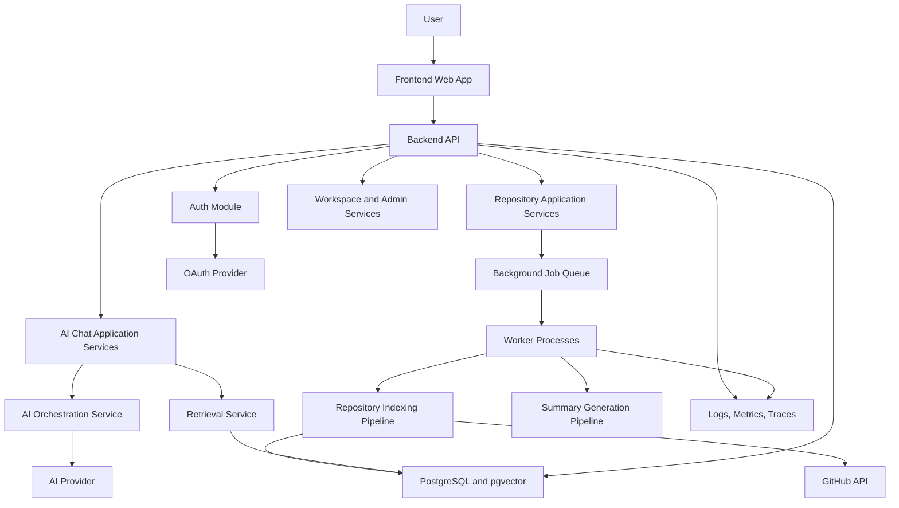

Primary responsibilities:

- Frontend: Presents repository intelligence workflows, authentication state, analysis progress, and chat experiences.
- Backend API: Validates requests, enforces authorization, coordinates use cases, and exposes product capabilities.
- Application services: Implement use cases without depending directly on frameworks or external providers.
- Background workers: Execute long-running repository ingestion, indexing, embedding, and summarization tasks.
- Database: Stores users, profiles, repositories, branches, indexing metadata, files, code chunks, embeddings, chat sessions, chat messages, citations, dependency edges, architecture snapshots, API keys, and audit logs.
- AI orchestration: Coordinates retrieval, prompt construction, model calls, response validation, and citation handling.
- Provider adapters: Integrate with GitHub, AI providers, storage, email, observability, and deployment infrastructure.

## 2. Frontend Architecture

The frontend should be organized around product workflows rather than technical concerns alone. Shared UI components should remain reusable, while repository-specific logic should live in feature modules.

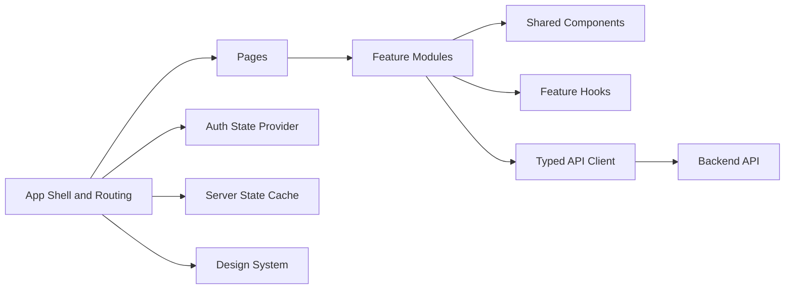

Recommended structure:

```text
frontend/
  src/
    app/
    api/
    components/
    features/
      auth/
      repositories/
      indexing/
      chat/
      workspace/
    hooks/
    lib/
    styles/
    types/
```

Frontend principles:

- Keep API access centralized behind typed clients.
- Use server-state tools for fetching, caching, invalidation, and polling indexing jobs.
- Keep forms validated at the browser boundary before calling backend APIs.
- Keep authentication state explicit and recoverable after refresh.
- Avoid putting business rules directly inside presentational components.
- Keep repository analysis status visible for long-running workflows.
- Never expose API keys, provider tokens, or internal secrets in browser code.

Core frontend feature areas:

- Authentication and session handling.
- Repository connection and selection.
- Repository analysis status.
- Repository overview and generated documentation.
- AI chat with citations.
- User feedback on answer quality.
- Workspace and account settings.

## 3. Backend Architecture

The backend follows Clean Architecture. Framework code should remain at the edges, while business use cases live in application services and core rules live in domain modules.

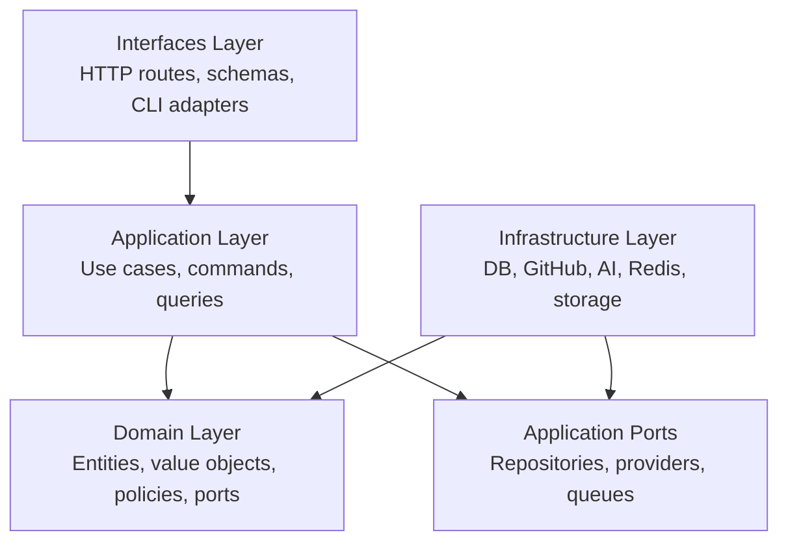

Recommended structure:

```text
backend/
  app/
    domain/
      repositories/
      users/
      organizations/
      conversations/
      indexing/
    application/
      repositories/
      indexing/
      chat/
      auth/
    infrastructure/
      persistence/
      github/
      ai/
      queue/
      storage/
      observability/
    interfaces/
      http/
      workers/
    config/
    shared/
  tests/
```

Backend principles:

- HTTP routes should validate input, call application services, and shape responses.
- Application services should orchestrate use cases and depend on interfaces.
- Domain models should not import FastAPI, SQLAlchemy, Redis, GitHub SDKs, or AI SDKs.
- Infrastructure adapters should implement defined ports.
- Background workers should call application services instead of duplicating business logic.
- Errors should be structured and mapped to safe API responses.
- Logs should include correlation IDs and operational context without exposing secrets.

Key backend modules:

- Auth service: Session management, OAuth callbacks, token storage coordination, and access checks.
- Repository service: Repository records, provider connections, permissions, and metadata.
- Indexing service: Repository ingestion, chunking, embedding, and indexing job orchestration.
- Retrieval service: Context search for AI workflows.
- AI chat service: Prompt assembly, model call orchestration, response validation, and citation handling.
- Audit service: Security-relevant and user-visible activity records.

## 4. Database Architecture

PostgreSQL is the primary system of record. `pgvector` can be used initially for embeddings to reduce infrastructure complexity.

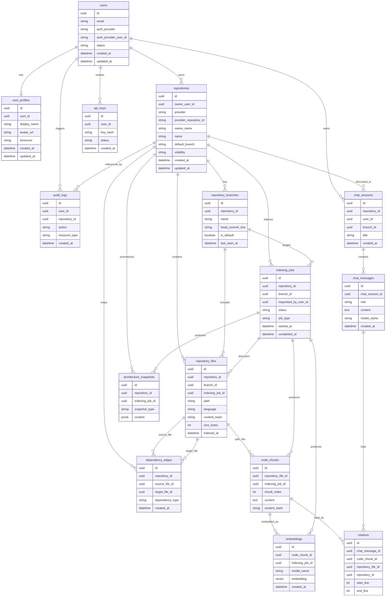

Database design principles:

- Use UUID primary keys for externally referenced product entities.
- Store provider identifiers separately from internal IDs.
- Store enough metadata to support re-indexing and auditability.
- Keep embeddings linked to specific chunks, models, and timestamps.
- Avoid storing raw access tokens without encryption.
- Use migrations for all schema changes.
- Add indexes for high-frequency lookup paths such as user ID, repository ID, branch ID, indexing job status, file path, chat session ID, citation lookup, and vector search.

## 5. Authentication Flow

Authentication should support secure user sessions and future team-based access control. GitHub OAuth can serve both authentication and repository authorization, but those concepts should remain separate in the architecture.

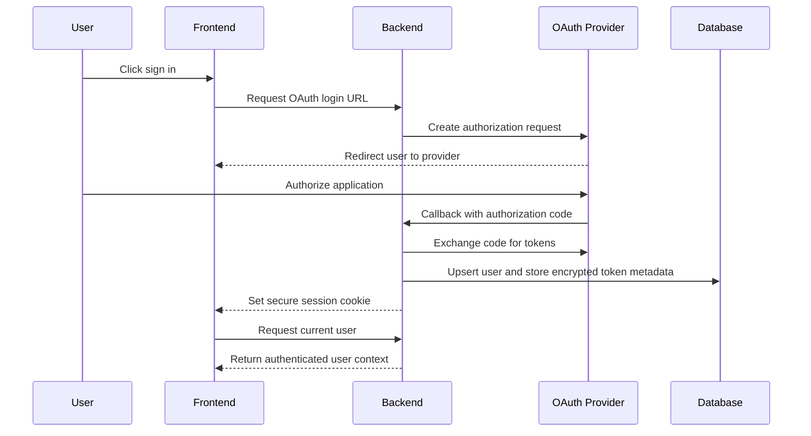

Authentication requirements:

- Use secure, HTTP-only cookies for browser sessions where possible.
- Separate identity authentication from repository provider authorization.
- Encrypt provider tokens at rest.
- Store token scopes and expiration metadata.
- Support token revocation and account disconnection.
- Apply CSRF protection for cookie-based sessions.
- Enforce organization and repository authorization on every protected backend request.

## 6. GitHub Integration Flow

GitHub integration should be implemented through a provider abstraction so GitLab, Bitbucket, and self-hosted providers can be added later.

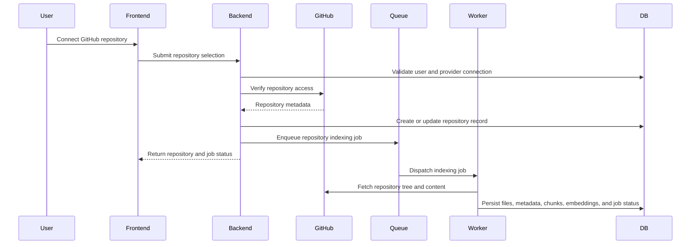

GitHub integration requirements:

- Request the minimum required OAuth scopes.
- Validate repository ownership and access before indexing.
- Respect provider rate limits.
- Handle private repositories as sensitive data.
- Avoid logging full source content or tokens.
- Store provider IDs and installation metadata for reliable synchronization.
- Support re-indexing when repository content changes.

Future GitHub capabilities:

- GitHub App installation flow.
- Webhooks for push and pull request events.
- Pull request impact analysis.
- Inline review comments where explicitly enabled.
- Organization-level repository discovery.

## 7. Repository Indexing Pipeline

Repository indexing converts repository content into structured metadata, searchable code chunks, embeddings, summaries, dependency edges, architecture snapshots, and citation-ready file references.

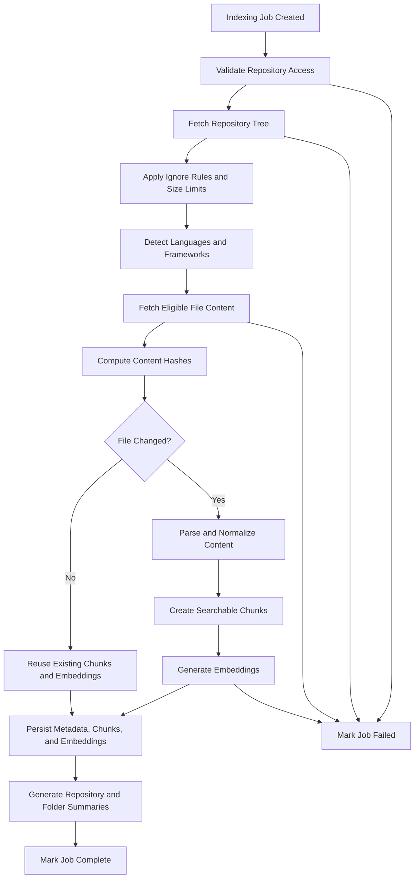

Indexing stages:

- Access validation: Confirm the user or organization can index the repository.
- Tree fetch: Retrieve repository paths, file sizes, commit metadata, and branch details.
- Filtering: Exclude ignored folders, generated files, binary files, large files, secrets, and unsupported file types.
- Language detection: Identify languages and frameworks for better chunking and summaries.
- Content hashing: Detect unchanged files and avoid unnecessary reprocessing.
- Chunking: Split files into meaningful units with stable references.
- Embedding: Convert chunks into vector representations for retrieval.
- Summarization: Generate repository, folder, and file-level summaries where useful.
- Persistence: Store repository metadata, repository_files, code_chunks, embeddings, dependency_edges, architecture_snapshots, and indexing job status transactionally where practical.

Indexing safeguards:

- Repository size limits.
- File size limits.
- Binary file detection.
- Timeout and retry policy.
- Provider rate limit handling.
- Sensitive file detection.
- Idempotent job behavior.

## 8. RAG Pipeline

Retrieval-augmented generation grounds AI responses in repository-specific context.


RAG requirements:

- Retrieve context only from repositories the user is authorized to access.
- Include file paths, line ranges, commit metadata, and chunk identifiers where available.
- Prefer hybrid retrieval when keyword matching is important for symbols, filenames, and exact error messages.
- Rerank results before prompt assembly when context volume is high.
- Keep prompt templates versioned and reviewable.
- Require citations for repository-specific claims.
- Clearly state uncertainty when retrieved context is insufficient.

Quality controls:

- Retrieval evaluation sets.
- Prompt regression tests.
- Citation validation.
- Token budget controls.
- Model fallback behavior.
- User feedback capture.

## 9. AI Chat Flow

AI chat should feel conversational while remaining grounded, auditable, and safe.

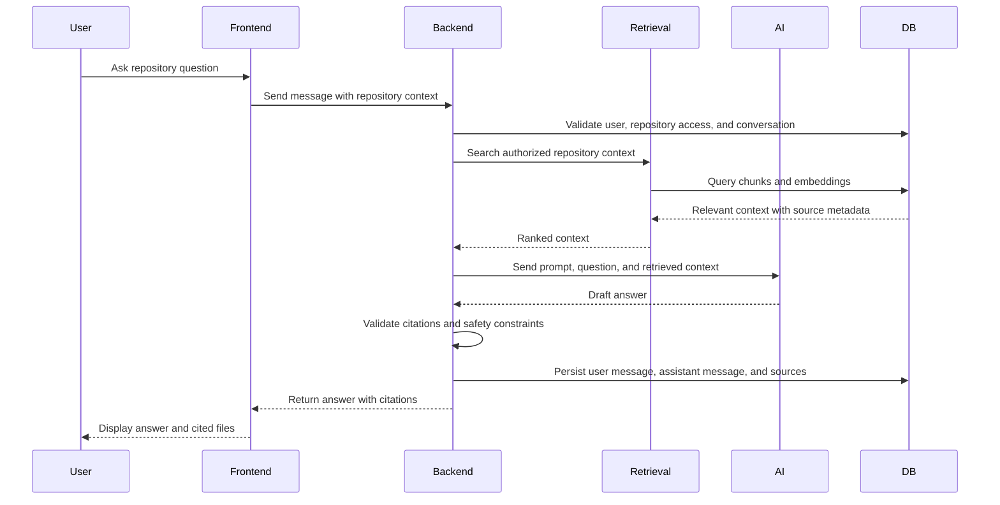

AI chat requirements:

- Every chat request must be authorized against the repository.
- User messages should be validated for size and abuse controls.
- Conversations should preserve message history where useful, but retrieval should remain the source of repository truth.
- Assistant responses should include citations for repository claims.
- The UI should expose source files and line ranges when available.
- The backend should track token usage, model choice, latency, and error rates.
- The system should handle model errors, timeouts, and rate limits gracefully.

## 10. Background Job Architecture

Long-running and retryable work should run in background workers. The API should enqueue jobs and return status rather than blocking on expensive operations.

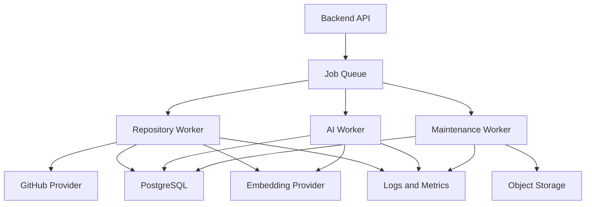

Job categories:

- Repository indexing jobs.
- Repository re-indexing jobs.
- Embedding generation jobs.
- Summary generation jobs.
- AI evaluation jobs.
- Cleanup and retention jobs.
- Webhook processing jobs.

Job architecture requirements:

- Jobs must be idempotent where possible.
- Job status must be persisted.
- Failed jobs must record safe diagnostic details.
- Retry policies must distinguish transient failures from permanent failures.
- Workers must enforce repository and tenant boundaries.
- Long-running jobs should emit progress events or status updates.
- Poison jobs should not block the queue indefinitely.

Recommended job states:

- `queued`
- `running`
- `succeeded`
- `failed`
- `cancelled`
- `retrying`

## 11. Deployment Architecture

Deployment should support separate development, staging, and production environments from the beginning.

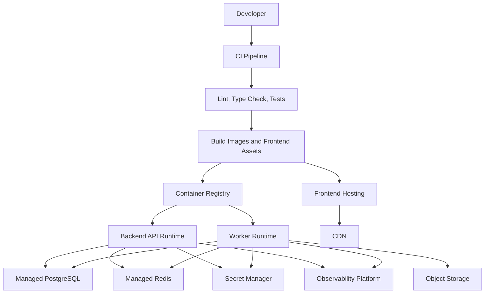

Deployment principles:

- Use separate environments for development, staging, and production.
- Run automated checks before deployment.
- Keep backend and worker deployments independently scalable.
- Validate configuration at startup.
- Store secrets in a managed secret store or deployment platform secret system.
- Run database migrations through controlled release steps.
- Define rollback procedures before production launch.
- Use health checks for API and worker processes.

Environment responsibilities:

- Development: Fast local feedback with Docker Compose or equivalent.
- Staging: Production-like validation, integration tests, and release verification.
- Production: Customer-facing environment with monitoring, backups, rate limits, and incident response.

## 12. Security Architecture

RepoMind AI handles source code, repository metadata, user identities, and provider credentials. Security must be a first-class architectural concern.

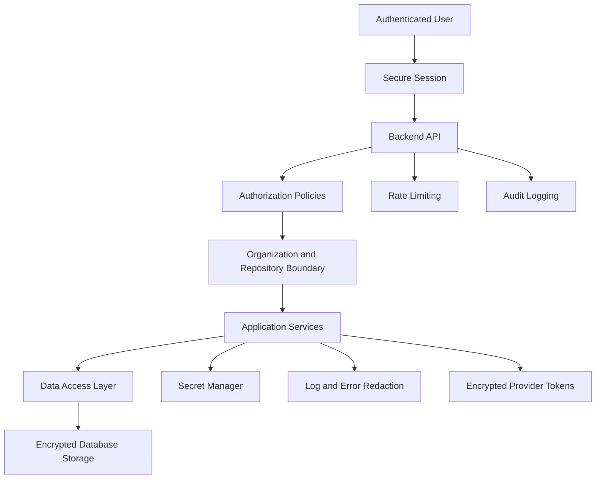

Security principles:

- Authenticate every protected request.
- Authorize every repository, conversation, job, and file access.
- Apply least privilege to provider tokens and service accounts.
- Encrypt secrets and provider tokens at rest.
- Use TLS for all network communication.
- Redact secrets, tokens, and private source content from logs.
- Maintain audit records for sensitive actions.
- Validate external inputs at API and application boundaries.
- Apply rate limits and abuse controls to AI and repository workflows.
- Isolate tenants by organization and repository access policy.

Security-sensitive data:

- OAuth access tokens and refresh tokens.
- Repository source code.
- Private repository metadata.
- User identity data.
- AI chat history containing repository context.
- Generated summaries and embeddings derived from private code.

Required controls:

- Token encryption at rest.
- Secure session cookies.
- CSRF protection for browser cookie flows.
- CORS allowlist configuration.
- Repository access checks before indexing and retrieval.
- Secret scanning safeguards during repository ingestion.
- Centralized authorization checks.
- Audit logs for repository connection, indexing, chat access, token revocation, and administrative actions.

## Cross-Cutting Architecture Concerns

### Observability

The system should provide enough visibility to debug failures, monitor costs, and understand product usage.

Required telemetry:

- API request latency and error rates.
- Background job duration, retries, and failures.
- Repository indexing throughput.
- AI provider latency, errors, and token usage.
- Retrieval quality signals.
- Authentication failures.
- Rate limit events.

### Configuration

Configuration must be environment-driven and validated at startup.

Configuration categories:

- Database connection settings.
- Redis connection settings.
- AI provider settings.
- GitHub OAuth and app settings.
- Session and cookie settings.
- Rate limits.
- Repository indexing limits.
- Logging level.
- Feature flags.

### Error Handling

Errors should be handled consistently across API and worker contexts.

Rules:

- Client-facing errors must be clear and safe.
- Internal logs should include correlation IDs and safe diagnostic metadata.
- Expected domain failures should map to typed application errors.
- Unexpected failures should be logged and surfaced as generic client errors.
- Worker failures should update persisted job status.

### Scalability

Early architecture should support future scale without premature complexity.

Scalability considerations:

- Queue-based repository indexing.
- Horizontal scaling for API and worker processes.
- Database indexes for user, repository, branch, indexing job, chat, citation, and audit lookup paths.
- Embedding model abstraction.
- Provider abstraction for repository services.
- Caching for repeated metadata and analysis status requests.
- Incremental re-indexing based on content hashes and provider events.

## Implementation Readiness Checklist

Before application code is generated, confirm:

- Product scope for the MVP is aligned with `docs/PRODUCT_VISION.md` and `docs/PROJECT_ROADMAP.md`.
- The canonical database table names match `docs/DATABASE.md`: `users`, `user_profiles`, `repositories`, `repository_branches`, `repository_files`, `code_chunks`, `embeddings`, `indexing_jobs`, `chat_sessions`, `chat_messages`, `citations`, `dependency_edges`, `architecture_snapshots`, `api_keys`, and `audit_logs`.
- API endpoints in `docs/API_SPEC.md` map to the database tables they read and write.
- UI pages in `docs/UI_UX.md` are backed by current API capabilities or clearly marked as future functionality.
- Security controls in `docs/SECURITY.md` cover the same API resources and database tables.
- Deployment assumptions in `docs/DEPLOYMENT.md` support separate frontend, backend API, worker, PostgreSQL, Redis, and AI provider configuration.
- Testing expectations in `docs/TESTING_STRATEGY.md` cover backend, frontend, API, security, performance, and AI/RAG behavior.
- No implementation starts until environment variables, secret handling, migration strategy, and repository indexing limits are defined for the first development milestone.

## Architecture Decision Records

Significant future decisions should be captured as architecture decision records.

Examples:

- Frontend framework selection.
- Background job library selection.
- Initial vector search strategy.
- Authentication provider and session strategy.
- GitHub OAuth versus GitHub App integration.
- AI provider and model selection.
- Deployment platform selection.

Each decision record should document context, decision, alternatives considered, tradeoffs, and consequences.
