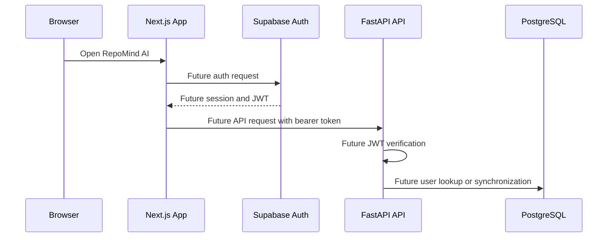
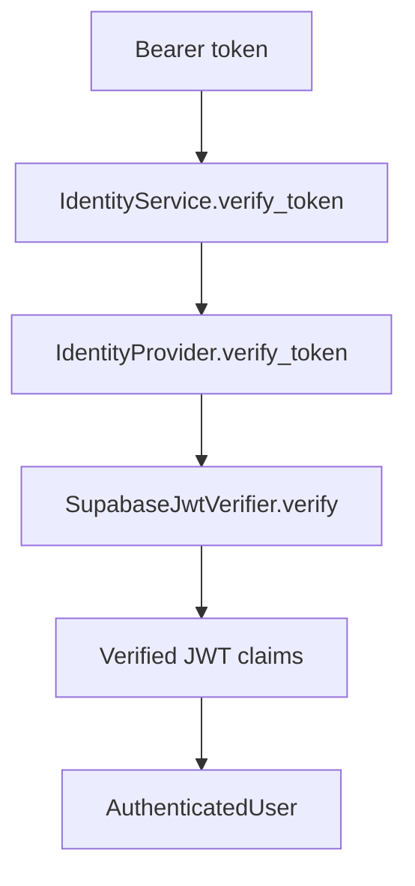
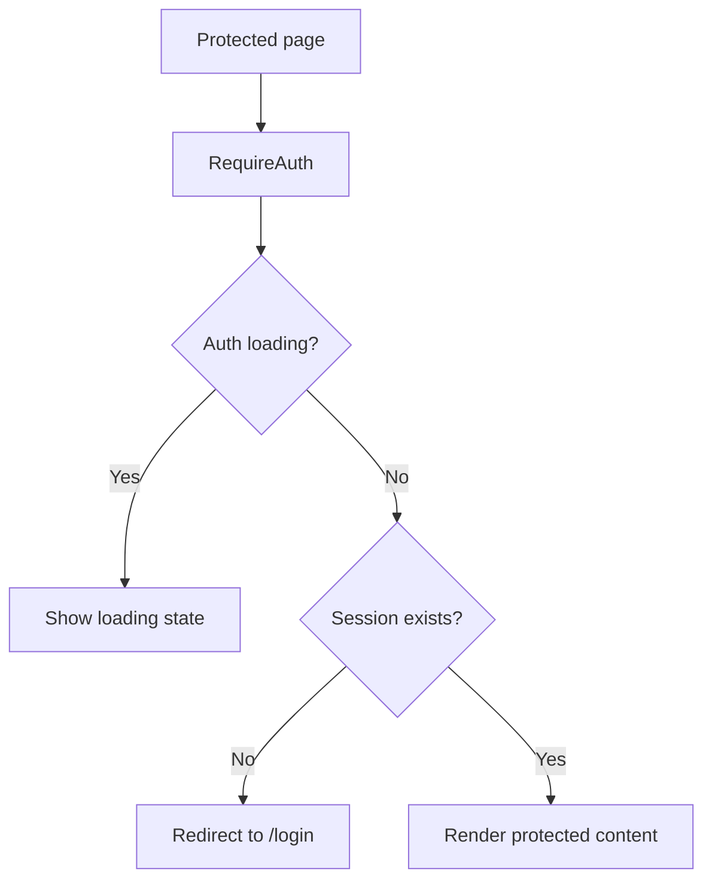
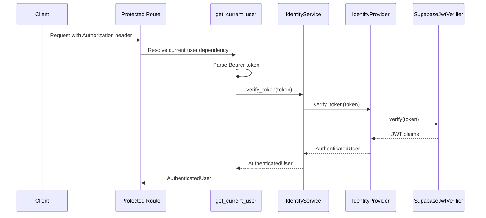
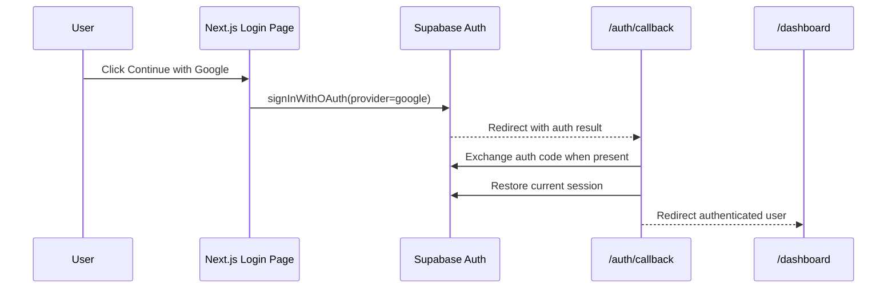
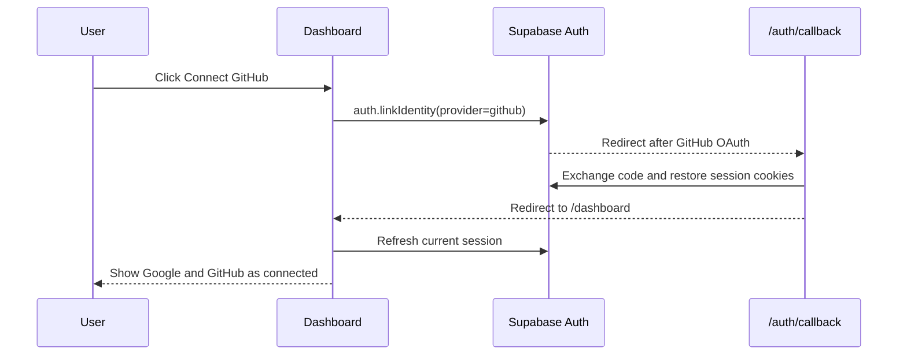
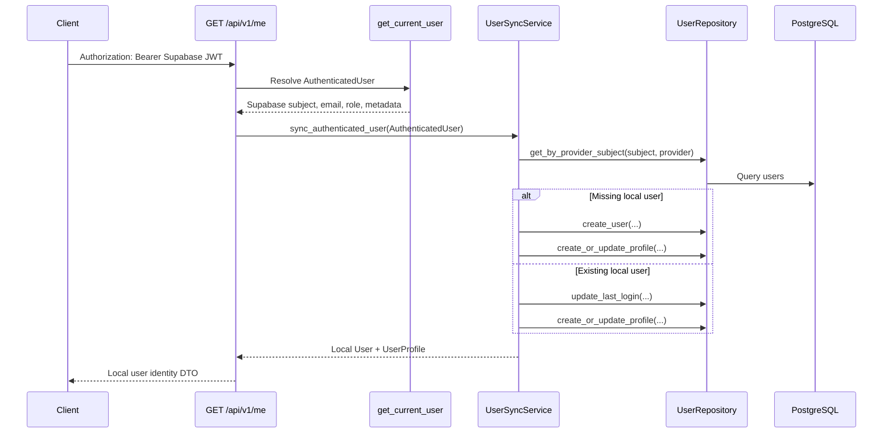
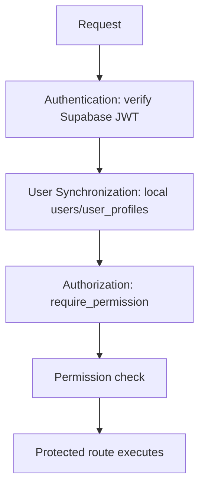

# Authentication Architecture

Sprint 3.1 established the Supabase identity foundation for RepoMind AI. Later Sprint 3 work adds protected backend dependency validation and Google OAuth on the frontend while still deferring GitHub login, RBAC enforcement, repository features, and user synchronization jobs.

## Identity Flow



Current scope:

- Frontend Supabase SDK clients are configured.
- The server-side Supabase client uses `@supabase/ssr` with Next.js cookies so OAuth callbacks can persist Supabase session cookies correctly.
- Backend Supabase configuration is loaded from environment variables.
- JWT verifier utilities are available and used by the current-user dependency for protected routes.
- `AuthenticatedUser`, `IdentityProvider`, and `IdentityService` abstractions are prepared.
- `GET /api/v1/me` is protected through dependency injection.
- Google login and the OAuth callback route are implemented on the frontend; RBAC enforcement and user synchronization are not implemented yet.

## Identity Domain Model

The backend uses a small domain identity model so application services do not depend directly on Supabase-specific claim shapes.

`AuthenticatedUser` contains:

- `provider_subject`: Stable external subject, such as the Supabase `sub` claim.
- `email`: Verified identity email from the provider token.
- `role`: Optional future application role.
- `metadata`: Safe provider metadata needed by future services.

This entity is not persisted during Sprint 3.1. Future user synchronization will map it to `users` and `user_profiles`.

## IdentityProvider Abstraction

`IdentityProvider` is a backend protocol with:

```text
verify_token(token: str) -> AuthenticatedUser
```

The first adapter is `SupabaseIdentityProvider`, which uses the Supabase JWT verifier and converts verified claims into `AuthenticatedUser`.

Routes must not verify JWTs directly. Protected routes depend on `get_current_user()`, which delegates token verification through `IdentityService`.

## IdentityService Flow



Current `IdentityService` responsibility:

- Accept an `IdentityProvider` dependency.
- Delegate `verify_token(token)`.
- Return `AuthenticatedUser`.

Deferred responsibilities:

- User database synchronization.
- Session persistence.
- Role and permission resolution.


## Frontend Auth Provider Flow

Sprint 3.3 adds a client-side authentication provider in `apps/web/features/auth/`.

Responsibilities:

- Create the browser Supabase client lazily.
- Read the current Supabase session.
- Track `session`, `user`, and `loading` state.
- Subscribe to Supabase auth state changes.
- Expose `refreshSession()` for session refresh preparation.
- Expose `signOut()` for logout foundation.

Missing Supabase environment variables must not crash static builds or module imports. The provider handles missing configuration by settling into an unauthenticated state until auth actions are used in a configured environment.

Google OAuth login is enabled through Supabase. GitHub sign-in remains a disabled placeholder on `/login`.

## Frontend Protected Route Flow

`RequireAuth` is the reusable route guard for frontend-only protected pages.



Current protected frontend page:

- `/dashboard`

The dashboard only shows the signed-in email and logout foundation. Repository features are intentionally not implemented in Sprint 3.3.

## Session Lifecycle

Current frontend session lifecycle:

1. `AuthProvider` mounts once at the root layout.
2. The provider lazily creates a Supabase browser client.
3. The provider calls `auth.getSession()` to load the initial session.
4. The provider subscribes to `auth.onAuthStateChange()`.
5. Session changes update the current `session` and `user` state.
6. `signOut()` clears local auth state after Supabase sign-out.
7. `refreshSession()` reloads the current Supabase session.

The backend API client in `apps/web/api/client.ts` can attach the Supabase access token as `Authorization: Bearer <token>` when a caller provides a session getter. Sprint 3 frontend auth work does not call protected repository endpoints.

## JWT Validation Pipeline

Sprint 3.2 introduces dependency-based JWT authentication for protected FastAPI endpoints.



Failure behavior:

- All authentication failures return `401` using the standard API error envelope.
- Missing `Authorization` header returns `401`.
- Invalid bearer format returns `401`.
- Malformed JWT structure returns `401`.
- Invalid JWT base64 or JSON returns `401`.
- Missing or invalid JWT claims return `401`.
- Expired JWT returns `401`.
- Authorization and RBAC failures will return `403` in a later sprint.

The pipeline uses FastAPI dependency injection only. Authentication middleware is intentionally not implemented.

## CurrentUser Dependency

`get_current_user()` is the reusable authentication dependency for protected routes.

Responsibilities:

- Read the `Authorization` header.
- Validate the `Bearer` token format.
- Call `IdentityService.verify_token(token)`.
- Return `AuthenticatedUser`.
- Convert authentication failures into the standard API error envelope.

Current protected endpoint:

- `GET /api/v1/me`

Response data:

```json
{
  "id": "provider-subject",
  "email": "user@example.com",
  "provider": "supabase",
  "role": "member",
  "metadata": {}
}
```

## JWT Verification Flow

Future protected routes will use this flow:

1. Extract `Authorization: Bearer <token>` from the request.
2. Verify the JWT signature using `SUPABASE_JWT_SECRET`.
3. Validate registered claims such as issuer, audience, and expiration.
4. Resolve or synchronize the application user.
5. Inject an authenticated principal into application services.

Sprint 3.1 only prepares the verifier utility, identity provider adapter, identity service, and dependency providers.

The current JWT verification helper is foundation-only. Before production, token verification should use a maintained JWT/JWKS-compatible library or the official Supabase verification approach for the deployed Supabase Auth configuration. Production verification must also include key rotation behavior, issuer and audience validation, clock-skew handling, and security review.

The server-side Supabase client now uses `createServerClient` from `@supabase/ssr` so it can read, set, and remove Supabase cookies through Next.js route-handler cookies. This is required for the `/auth/callback` route to exchange Google OAuth codes and persist sessions across refreshes.

## OAuth Architecture

Supabase owns external OAuth provider interaction. Google OAuth currently follows this flow:

1. The frontend starts OAuth through Supabase Auth.
2. Supabase redirects back to the frontend after provider authorization.
3. The frontend receives a Supabase session.
4. API requests include the Supabase access token.
5. The backend verifies the token and maps the identity to RepoMind AI users.

GitHub OAuth for repository installation and access remains a separate future integration. It must not be mixed with application login concerns.

Google OAuth is implemented on the frontend through Supabase Auth. GitHub OAuth is not implemented. The FastAPI backend does not handle OAuth callbacks.


## Google OAuth Flow

Sprint 3.4B enables Google sign-in through Supabase Auth from the frontend only.



Current scope:

- Google OAuth is enabled through Supabase.
- GitHub OAuth is not enabled yet.
- No repository features are introduced.
- No RBAC enforcement is introduced.
- Users are not synchronized into the application database yet.

## OAuth Callback Flow

`/auth/callback` is the frontend callback route for Supabase OAuth redirects.

Responsibilities:

- Read the OAuth callback URL.
- Exchange the auth code when Supabase provides one.
- Restore the current Supabase session.
- Redirect authenticated users to `/dashboard`.
- Redirect failures to `/login?error=authentication_failed`.

The callback route uses the cookie-aware Supabase SSR client to exchange the OAuth code, write Supabase session cookies through Next.js, and then read the restored session. It does not create application users, assign roles, or connect repositories.

## Linked Provider Architecture

Sprint 3.8B adds GitHub account linking through Supabase identity linking. This is separate from future GitHub repository access.

Identity model:

- Google remains the current sign-in provider for application authentication.
- GitHub can be linked as an additional Supabase identity on the same authenticated Supabase user.
- Linking must not create a second RepoMind AI account or local `users` row.
- The frontend reads `user.identities` from the refreshed Supabase session to display connected providers.



Error handling:

- OAuth cancellation returns the user to the dashboard with a friendly linking message.
- OAuth failure returns the user to the dashboard when the existing session survives.
- Missing or invalid sessions still redirect to `/login?error=authentication_failed`.
- Identity already linked and provider unavailable states are displayed as safe user-facing messages.

Important boundary:

- GitHub identity linking is not GitHub repository integration.
- Sprint 3.8B does not call the GitHub REST API, list repositories, register repositories, clone code, or request repository data.
## User Synchronization Architecture

Sprint 3.6 synchronizes verified Supabase identities into local PostgreSQL records when protected backend routes need the current user.



Supabase user versus local user:

- The Supabase user is the external identity source and is represented in the backend as `AuthenticatedUser` after JWT verification.
- The local `users` row is RepoMind AI's durable application identity, keyed to Supabase through `auth_provider = "supabase"` and `auth_provider_user_id = provider_subject`.
- The local `user_profiles` row stores display-facing profile metadata such as display name and avatar URL.

Why local users exist:

- Repository ownership, chat sessions, API keys, audit logs, billing, and future workspace membership need stable local foreign keys.
- Local profile data lets RepoMind AI support product preferences without writing back to Supabase Auth.
- Local records make future authorization, auditing, and enterprise administration possible without coupling every domain table to provider-specific claim formats.

Synchronization rules:

- Routes do not query SQLAlchemy directly.
- `GET /api/v1/me` verifies the JWT through the existing identity pipeline, then calls `UserSyncService`.
- `UserSyncService` uses `UserRepository` for all persistence operations.
- Sync is transactional: user and profile changes are flushed in one unit of work and rolled back together on failure.
- Raw Supabase access tokens and refresh tokens are never stored in application tables.
- Audit logging for identity-sensitive sync events is deferred to a later sprint.

## Authorization and RBAC Foundation

Sprint 3.7 introduces a role-based authorization foundation after authentication and user synchronization.



Authorization order:

1. Authentication validates the Supabase JWT and produces `AuthenticatedUser`.
2. User synchronization resolves or creates the local `users` row and `user_profiles` row.
3. Authorization evaluates the local user's stored role against a permission policy.
4. The route executes only when the required permission is granted.

Initial roles:

| Role | Description |
| --- | --- |
| `user` | Default role for synchronized users. Can view and edit profile-level resources and initiate future repository connection flows. |
| `admin` | Administrative role. Includes all current user permissions plus access to admin-only endpoints. |

Initial permissions:

| Permission | Purpose |
| --- | --- |
| `view_profile` | Read the current user's local profile identity. |
| `edit_profile` | Future profile preference updates. |
| `connect_repository` | Future repository connection workflows. |
| `view_admin_panel` | Admin-only operational/admin surfaces. |

Current protected authorization probe:

- `GET /api/v1/admin/ping` requires `view_admin_panel`, which is granted only to `admin`.

Failure behavior:

- Missing or invalid authentication returns `401`.
- Authenticated users without the required permission return `403` with code `forbidden` and message `You do not have permission.`

RBAC enforcement remains intentionally small in Sprint 3.7. GitHub integration, repository authorization, organization roles, and the admin dashboard are not implemented.
## Future RBAC Design

RBAC is intentionally deferred. Future authorization should support:

- User-level roles for early administrative capabilities.
- Organization-level roles when organizations are introduced.
- Repository-level access grants for shared repositories.
- API key scopes for programmatic access.
- Audit logging for permission changes and denied actions.

Planned roles may include:

- `owner`
- `admin`
- `member`
- `viewer`

Authorization checks should live in application policies or services, not middleware alone.

## Environment Variables

Frontend:

- `NEXT_PUBLIC_SUPABASE_URL`
- `NEXT_PUBLIC_SUPABASE_ANON_KEY`

Backend:

- `SUPABASE_URL`
- `SUPABASE_ANON_KEY`
- `SUPABASE_SERVICE_ROLE_KEY`
- `SUPABASE_JWT_SECRET`

The service role key and JWT secret must never be exposed to the browser, committed to source control, logged, or returned by an API.


