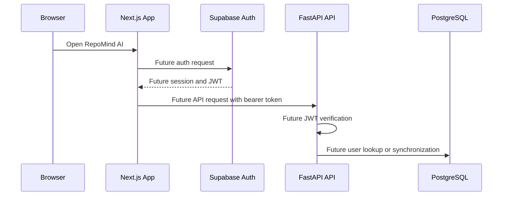
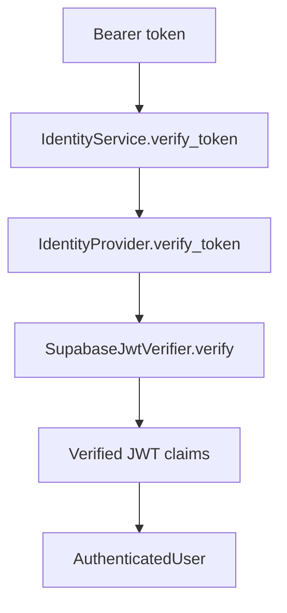
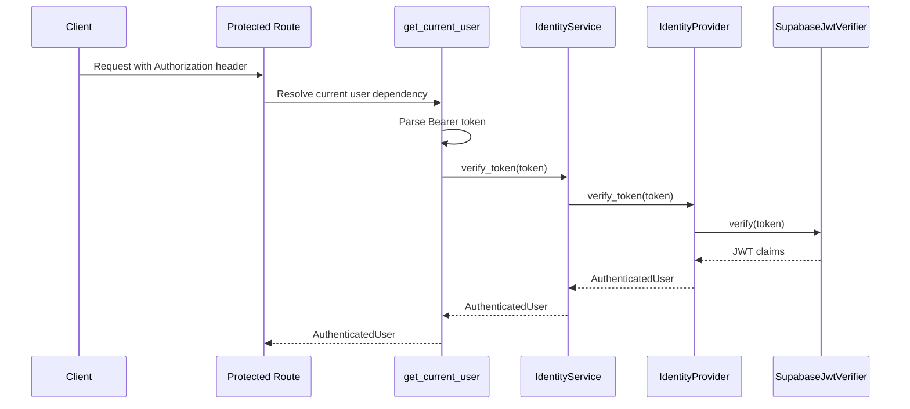

# Authentication Architecture

Sprint 3.1 establishes the Supabase identity foundation for RepoMind AI. It does not implement login, OAuth callback handling, RBAC enforcement, protected routes, or user synchronization jobs.

## Identity Flow



Current scope:

- Frontend Supabase SDK clients are configured.
- The server-side Supabase client is a foundation-only factory and is not cookie-aware yet.
- Backend Supabase configuration is loaded from environment variables.
- JWT verifier utilities are available and used by the current-user dependency for protected routes.
- `AuthenticatedUser`, `IdentityProvider`, and `IdentityService` abstractions are prepared.
- `GET /api/v1/me` is protected through dependency injection.
- Login, OAuth callbacks, RBAC enforcement, and user synchronization are not implemented yet.

## Identity Domain Model

The backend uses a small domain identity model so application services do not depend directly on Supabase-specific claim shapes.

`AuthenticatedUser` contains:

- `provider_subject`: Stable external subject, such as the Supabase `sub` claim.
- `email`: Verified identity email from the provider token.
- `role`: Optional future application role.
- `metadata`: Safe provider metadata needed by future services.

This entity is not persisted during Sprint 3.1. Future user synchronization will map it to `users` and `user_profiles`.

## IdentityProvider Abstraction

`IdentityProvider` is a backend protocol with:

```text
verify_token(token: str) -> AuthenticatedUser
```

The first adapter is `SupabaseIdentityProvider`, which uses the Supabase JWT verifier and converts verified claims into `AuthenticatedUser`.

Routes must not verify JWTs directly. Protected routes depend on `get_current_user()`, which delegates token verification through `IdentityService`.

## IdentityService Flow



Current `IdentityService` responsibility:

- Accept an `IdentityProvider` dependency.
- Delegate `verify_token(token)`.
- Return `AuthenticatedUser`.

Deferred responsibilities:

- User database synchronization.
- Session persistence.
- Role and permission resolution.

## JWT Validation Pipeline

Sprint 3.2 introduces dependency-based JWT authentication for protected FastAPI endpoints.



Failure behavior:

- Missing `Authorization` header returns `401`.
- Invalid bearer format returns `401`.
- Invalid JWT returns `401`.
- Expired JWT returns `401`.
- Authorization failures that happen after authentication should return `403`.

The pipeline uses FastAPI dependency injection only. Authentication middleware is intentionally not implemented.

## CurrentUser Dependency

`get_current_user()` is the reusable authentication dependency for protected routes.

Responsibilities:

- Read the `Authorization` header.
- Validate the `Bearer` token format.
- Call `IdentityService.verify_token(token)`.
- Return `AuthenticatedUser`.
- Convert authentication failures into the standard API error envelope.

Current protected endpoint:

- `GET /api/v1/me`

Response data:

```json
{
  "id": "provider-subject",
  "email": "user@example.com",
  "provider": "supabase",
  "role": "member",
  "metadata": {}
}
```

## JWT Verification Flow

Future protected routes will use this flow:

1. Extract `Authorization: Bearer <token>` from the request.
2. Verify the JWT signature using `SUPABASE_JWT_SECRET`.
3. Validate registered claims such as issuer, audience, and expiration.
4. Resolve or synchronize the application user.
5. Inject an authenticated principal into application services.

Sprint 3.1 only prepares the verifier utility, identity provider adapter, identity service, and dependency providers.

The current JWT verification helper is foundation-only. Before production, token verification should use a maintained JWT/JWKS-compatible library or the official Supabase verification approach for the deployed Supabase Auth configuration. Production verification must also include key rotation behavior, issuer and audience validation, clock-skew handling, and security review.

When SSR authentication is implemented, the server-side Supabase client should become cookie-aware so it can read and refresh Supabase sessions safely through Next.js request and response cookies.

## OAuth Architecture

Supabase will own external OAuth provider interaction. The expected future OAuth flow is:

1. The frontend starts OAuth through Supabase Auth.
2. Supabase redirects back to the frontend after provider authorization.
3. The frontend receives a Supabase session.
4. API requests include the Supabase access token.
5. The backend verifies the token and maps the identity to RepoMind AI users.

GitHub OAuth for repository installation and access remains a separate future integration. It must not be mixed with application login concerns.

OAuth is not implemented in Sprint 3.1. No frontend route starts OAuth, and no backend route handles OAuth callbacks.

## User Synchronization Architecture

Future user synchronization should:

- Treat Supabase Auth as the identity provider.
- Store application-specific user state in `users` and `user_profiles`.
- Match users by stable Supabase subject claims.
- Avoid storing raw access tokens or refresh tokens in application tables.
- Create audit logs for identity-sensitive events.

Synchronization should happen in application services, not route handlers.

## Future RBAC Design

RBAC is intentionally deferred. Future authorization should support:

- User-level roles for early administrative capabilities.
- Organization-level roles when organizations are introduced.
- Repository-level access grants for shared repositories.
- API key scopes for programmatic access.
- Audit logging for permission changes and denied actions.

Planned roles may include:

- `owner`
- `admin`
- `member`
- `viewer`

Authorization checks should live in application policies or services, not middleware alone.

## Environment Variables

Frontend:

- `NEXT_PUBLIC_SUPABASE_URL`
- `NEXT_PUBLIC_SUPABASE_ANON_KEY`

Backend:

- `SUPABASE_URL`
- `SUPABASE_ANON_KEY`
- `SUPABASE_SERVICE_ROLE_KEY`
- `SUPABASE_JWT_SECRET`

The service role key and JWT secret must never be exposed to the browser, committed to source control, logged, or returned by an API.
