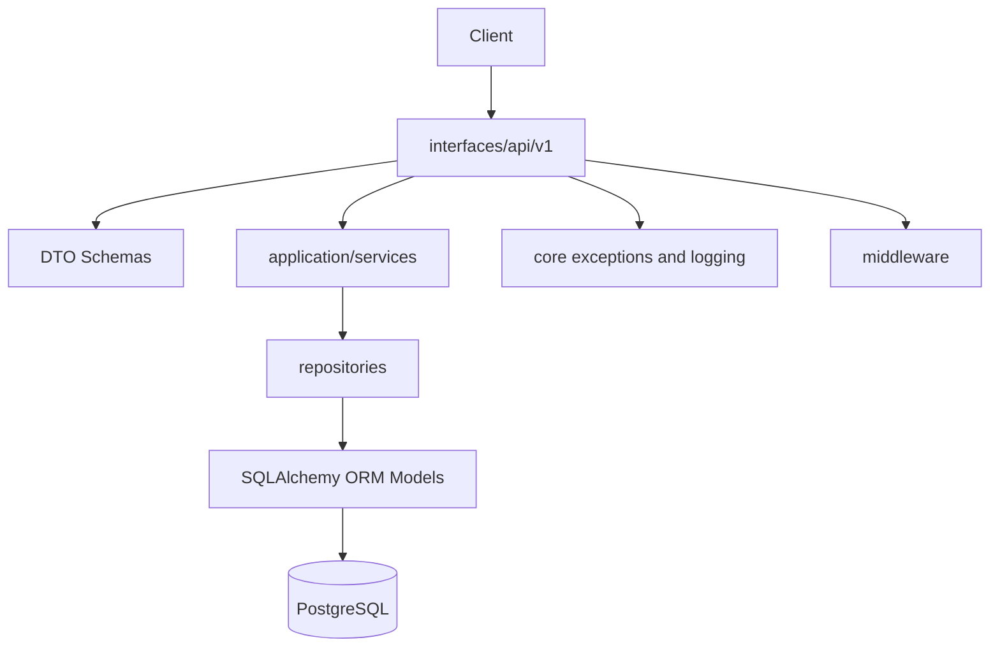

# Backend Architecture

RepoMind AI uses a layered FastAPI backend designed for long-term maintainability. The current Sprint 2 scope introduces architecture boundaries only; it does not add authentication, GitHub integration, repository indexing, chat behavior, or AI workflows.

## Layers



## Dependency Flow

Dependencies point inward:

- `interfaces` owns HTTP routes, DTOs, middleware integration, and FastAPI dependency wiring.
- `application/services` owns use-case orchestration. Current services are placeholders with constructor injection only.
- `repositories` owns SQLAlchemy persistence operations and prevents future services from exposing raw ORM queries.
- `infrastructure/database` owns SQLAlchemy engine, sessions, ORM models, and Alembic migrations.
- `core` owns cross-cutting exception and logging concerns.

## Repository Pattern

The repository layer lives in `apps/api/app/repositories/`.

- `base.py` provides generic SQLAlchemy primitives such as `get_by_id`, `list`, `add`, and `delete`.
- `user_repository.py` encapsulates user persistence.
- `repository_repository.py` encapsulates repository and branch persistence.
- `indexing_repository.py` encapsulates indexing persistence records.
- `chat_repository.py` encapsulates chat persistence records.

Future services should depend on repositories instead of importing SQLAlchemy models or writing ORM queries directly.

## Service Layer

The service layer lives in `apps/api/app/application/services/`.

Current services:

- `UserService`
- `RepositoryService`
- `IndexingService`
- `ChatService`

They currently implement dependency injection only. Business logic should be added here in future milestones, not in route handlers.

## DTOs

The DTO layer lives in `apps/api/app/interfaces/api/schemas/`.

- `requests/` contains request DTOs such as pagination examples.
- `responses/` contains response DTOs and the standard API envelope.

API routes must return DTOs or response envelopes, not ORM models.

## Middleware

The middleware layer lives in `apps/api/app/middleware/`.

- `RequestIdMiddleware` attaches or generates `X-Request-ID`.
- `LoggingMiddleware` emits one structured request log per HTTP request.
- `ErrorHandlingMiddleware` returns safe standardized responses for unhandled errors.

Authentication middleware is intentionally not implemented in Sprint 2.

## Logging

Structured logging is configured in `apps/api/app/core/logging.py`.

Logging features:

- JSON logs by default.
- Environment-based log level through `LOG_LEVEL`.
- Request ID enrichment through context variables.
- Central `dictConfig` setup.

Logs must not include secrets, raw tokens, private source content, or full API keys.

## Exceptions

Application exceptions live in `apps/api/app/core/exceptions/`.

Supported exception types:

- `BaseAppException`
- `ValidationException`
- `AuthorizationException`
- `ResourceNotFoundException`
- `ConflictException`
- `ExternalServiceException`

FastAPI handlers convert application and request validation exceptions into the standard failure envelope.

## API Versioning

Versioned routes live under:

```text
/api/v1/
```

Current versioned routes:

- `GET /api/v1/health`
- `GET /api/v1/status`

The unversioned `GET /health` endpoint remains available as a minimal operational health check.

## Response Standard

Success:

```json
{
  "success": true,
  "data": {},
  "meta": {}
}
```

Failure:

```json
{
  "success": false,
  "error": {
    "code": "resource_not_found",
    "message": "The requested resource was not found."
  }
}
```

## Configuration

Settings are split by environment in `apps/api/app/config/`:

- `base.py`
- `development.py`
- `production.py`
- `testing.py`
- `settings.py`

`settings.py` remains the backwards-compatible factory used by existing imports.
