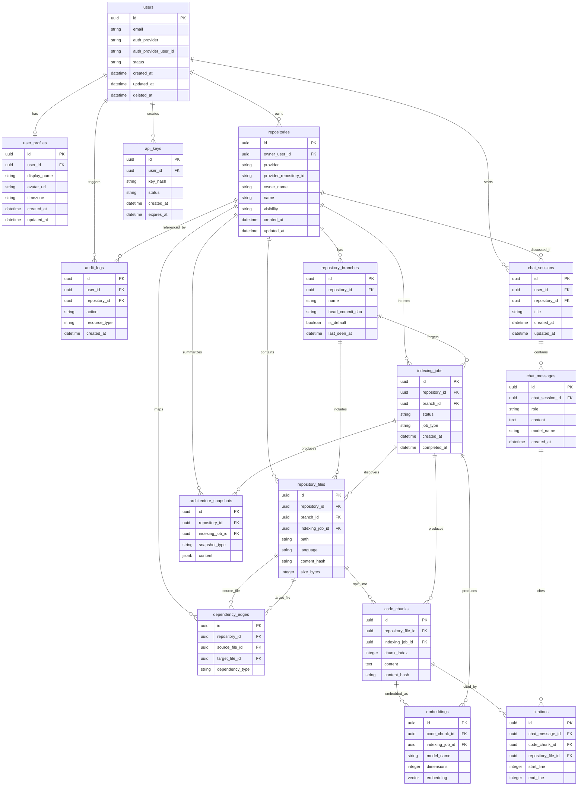

# RepoMind AI Database Design

## Purpose

This document defines the production-ready PostgreSQL database design for RepoMind AI. It is a planning and architecture document only. It does not define SQL migrations, ORM models, or executable schema code.

The database must support repository ingestion, code indexing, vector retrieval, AI chat, citations, dependency analysis, auditability, and future enterprise scale.

## 1. Database Design Philosophy

RepoMind AI should use PostgreSQL as the primary system of record because repository intelligence requires strong consistency for users, repositories, indexing state, conversations, and audit trails.

Design principles:

- Use relational integrity for core product entities.
- Keep repository-derived data traceable to its repository, branch, file, chunk, and indexing job.
- Store embeddings separately from chunks so embedding models can be changed or regenerated without rewriting source chunk records.
- Preserve enough metadata to support incremental re-indexing.
- Treat repository source, generated summaries, embeddings, chat history, API keys, and audit data as sensitive.
- Prefer explicit foreign keys for correctness during early and mid-stage development.
- Use soft deletion where auditability and recoverability matter.
- Use immutable historical records for chat messages, citations, audit logs, and architecture snapshots.
- Keep large-scale future partitioning paths available by consistently including `repository_id`, `user_id`, `created_at`, and job timestamps.
- Design for multi-tenant organizations in the future, even if the first version starts with individual users.

Primary database capabilities:

- Relational storage for product state.
- Vector retrieval through `pgvector`.
- Full-text and metadata filtering for hybrid search.
- Operational auditability.
- Incremental re-indexing based on content hashes.
- Safe migrations through Alembic.

## 2. Entity Relationship Diagram

## 3. Table Designs

### users

Purpose: Stores authenticated user accounts and identity-provider linkage.

| Column | Data Type | Notes |
| --- | --- | --- |
| `id` | UUID | Primary key. |
| `email` | VARCHAR(320) | Normalized email address. |
| `auth_provider` | VARCHAR(50) | Identity provider, such as `github` or future SSO provider. |
| `auth_provider_user_id` | VARCHAR(255) | Stable provider-side user identifier. |
| `status` | VARCHAR(30) | Account lifecycle state. |
| `last_login_at` | TIMESTAMPTZ | Most recent successful login. |
| `created_at` | TIMESTAMPTZ | Creation timestamp. |
| `updated_at` | TIMESTAMPTZ | Last update timestamp. |
| `deleted_at` | TIMESTAMPTZ | Nullable soft-delete timestamp. |

Primary key: `id`.

Foreign keys: None.

Constraints:

- `email` must be unique among active users.
- `auth_provider` and `auth_provider_user_id` together must be unique.
- `status` should be constrained to allowed account states such as `active`, `suspended`, and `deleted`.
- `email` must not be null.
- `created_at` and `updated_at` must not be null.

Indexes:

- Unique index on `email` for active users.
- Unique index on `auth_provider`, `auth_provider_user_id`.
- Index on `status`.
- Index on `created_at`.

### user_profiles

Purpose: Stores user-facing profile metadata separately from authentication identity.

| Column | Data Type | Notes |
| --- | --- | --- |
| `id` | UUID | Primary key. |
| `user_id` | UUID | References `users.id`. |
| `display_name` | VARCHAR(120) | User-visible name. |
| `avatar_url` | TEXT | Optional profile image URL. |
| `timezone` | VARCHAR(80) | IANA timezone name when known. |
| `locale` | VARCHAR(20) | User locale preference. |
| `created_at` | TIMESTAMPTZ | Creation timestamp. |
| `updated_at` | TIMESTAMPTZ | Last update timestamp. |

Primary key: `id`.

Foreign keys:

- `user_id` references `users.id`.

Constraints:

- `user_id` must be unique.
- `display_name` length should be bounded.
- `timezone` should be nullable until user preference is known.

Indexes:

- Unique index on `user_id`.
- Index on `display_name` if user search is introduced.

### repositories

Purpose: Stores connected repositories and provider metadata.

| Column | Data Type | Notes |
| --- | --- | --- |
| `id` | UUID | Primary key. |
| `owner_user_id` | UUID | References the user who first connected or owns the repository in the current MVP model. |
| `provider` | VARCHAR(50) | Repository provider, initially `github`. |
| `provider_repository_id` | VARCHAR(255) | Stable provider-side repository ID. |
| `owner_name` | VARCHAR(255) | Provider owner or organization name. |
| `name` | VARCHAR(255) | Repository name. |
| `full_name` | VARCHAR(511) | Provider display name, such as `owner/name`. |
| `default_branch` | VARCHAR(255) | Current default branch name. |
| `visibility` | VARCHAR(30) | Repository visibility. |
| `clone_url` | TEXT | Optional provider clone URL, sanitized for credentials. |
| `web_url` | TEXT | Provider web URL. |
| `last_indexed_at` | TIMESTAMPTZ | Most recent successful indexing timestamp. |
| `created_at` | TIMESTAMPTZ | Creation timestamp. |
| `updated_at` | TIMESTAMPTZ | Last update timestamp. |
| `archived_at` | TIMESTAMPTZ | Nullable archive timestamp. |

Primary key: `id`.

Foreign keys:

- `owner_user_id` references `users.id`.

Constraints:

- `provider` and `provider_repository_id` together must be unique.
- `visibility` should be constrained to supported values such as `public`, `private`, and `internal`.
- `provider`, `owner_name`, `name`, and `default_branch` must not be null.

Indexes:

- Unique index on `provider`, `provider_repository_id`.
- Index on `owner_user_id`.
- Index on `full_name`.
- Index on `last_indexed_at`.
- Index on `archived_at`.

### repository_branches

Purpose: Tracks branches known to RepoMind AI for each repository.

| Column | Data Type | Notes |
| --- | --- | --- |
| `id` | UUID | Primary key. |
| `repository_id` | UUID | References `repositories.id`. |
| `name` | VARCHAR(255) | Branch name. |
| `head_commit_sha` | CHAR(40) | Current Git commit SHA for the branch head. |
| `is_default` | BOOLEAN | Whether this is the repository default branch. |
| `last_seen_at` | TIMESTAMPTZ | Last time provider confirmed this branch. |
| `created_at` | TIMESTAMPTZ | Creation timestamp. |
| `updated_at` | TIMESTAMPTZ | Last update timestamp. |

Primary key: `id`.

Foreign keys:

- `repository_id` references `repositories.id`.

Constraints:

- `repository_id` and `name` together must be unique.
- A repository should have at most one default branch.
- `name` and `head_commit_sha` must not be null.

Indexes:

- Unique index on `repository_id`, `name`.
- Partial unique index on `repository_id` where `is_default` is true.
- Index on `head_commit_sha`.
- Index on `last_seen_at`.

### repository_files

Purpose: Stores metadata for files discovered during repository indexing.

| Column | Data Type | Notes |
| --- | --- | --- |
| `id` | UUID | Primary key. |
| `repository_id` | UUID | References `repositories.id`. |
| `branch_id` | UUID | References `repository_branches.id`. |
| `indexing_job_id` | UUID | References the job that last discovered or updated the file. |
| `path` | TEXT | Repository-relative file path. |
| `language` | VARCHAR(80) | Detected language. |
| `mime_type` | VARCHAR(120) | Detected MIME type when available. |
| `content_hash` | CHAR(64) | SHA-256 hash of normalized file content. |
| `blob_sha` | VARCHAR(80) | Provider or Git blob identifier. |
| `size_bytes` | INTEGER | File size in bytes. |
| `line_count` | INTEGER | Number of lines. |
| `is_binary` | BOOLEAN | Whether file is binary. |
| `is_generated` | BOOLEAN | Whether file appears generated. |
| `indexed_at` | TIMESTAMPTZ | Last successful indexing timestamp. |
| `created_at` | TIMESTAMPTZ | Creation timestamp. |
| `updated_at` | TIMESTAMPTZ | Last update timestamp. |
| `deleted_at` | TIMESTAMPTZ | Nullable soft-delete timestamp for removed files. |

Primary key: `id`.

Foreign keys:

- `repository_id` references `repositories.id`.
- `branch_id` references `repository_branches.id`.
- `indexing_job_id` references `indexing_jobs.id`.

Constraints:

- `repository_id`, `branch_id`, and `path` together must be unique for active files.
- `size_bytes` must be greater than or equal to zero.
- `line_count` must be greater than or equal to zero when present.
- `content_hash` should be nullable for binary or skipped files.
- `path` must not be null.

Indexes:

- Unique active-file index on `repository_id`, `branch_id`, `path`.
- Index on `repository_id`, `branch_id`.
- Index on `indexing_job_id`.
- Index on `language`.
- Index on `content_hash`.
- Trigram or full-text index on `path` for file search.

### code_chunks

Purpose: Stores normalized searchable code and documentation chunks derived from repository files.

| Column | Data Type | Notes |
| --- | --- | --- |
| `id` | UUID | Primary key. |
| `repository_file_id` | UUID | References `repository_files.id`. |
| `indexing_job_id` | UUID | References `indexing_jobs.id`. |
| `chunk_index` | INTEGER | Stable order within the file for the current content hash. |
| `chunk_type` | VARCHAR(50) | Type such as `code`, `doc`, `config`, or `test`. |
| `symbol_name` | VARCHAR(255) | Optional function, class, or exported symbol name. |
| `start_line` | INTEGER | First source line included. |
| `end_line` | INTEGER | Last source line included. |
| `content` | TEXT | Normalized chunk content. |
| `content_hash` | CHAR(64) | SHA-256 hash of chunk content. |
| `token_count` | INTEGER | Approximate token count. |
| `created_at` | TIMESTAMPTZ | Creation timestamp. |
| `updated_at` | TIMESTAMPTZ | Last update timestamp. |

Primary key: `id`.

Foreign keys:

- `repository_file_id` references `repository_files.id`.
- `indexing_job_id` references `indexing_jobs.id`.

Constraints:

- `repository_file_id` and `chunk_index` together must be unique for active file content.
- `start_line` must be greater than zero when present.
- `end_line` must be greater than or equal to `start_line`.
- `token_count` must be greater than or equal to zero.
- `content` and `content_hash` must not be null.

Indexes:

- Unique index on `repository_file_id`, `chunk_index`.
- Index on `indexing_job_id`.
- Index on `content_hash`.
- Index on `chunk_type`.
- Index on `symbol_name`.
- Full-text index on `content`.

### embeddings

Purpose: Stores vector embeddings for code chunks to support semantic retrieval.

| Column | Data Type | Notes |
| --- | --- | --- |
| `id` | UUID | Primary key. |
| `code_chunk_id` | UUID | References `code_chunks.id`. |
| `indexing_job_id` | UUID | References `indexing_jobs.id`. |
| `model_provider` | VARCHAR(80) | Embedding provider name. |
| `model_name` | VARCHAR(120) | Embedding model name. |
| `dimensions` | INTEGER | Number of vector dimensions. |
| `embedding` | VECTOR | pgvector embedding column. |
| `content_hash` | CHAR(64) | Chunk content hash used for this embedding. |
| `created_at` | TIMESTAMPTZ | Creation timestamp. |

Primary key: `id`.

Foreign keys:

- `code_chunk_id` references `code_chunks.id`.
- `indexing_job_id` references `indexing_jobs.id`.

Constraints:

- `code_chunk_id`, `model_provider`, `model_name`, and `content_hash` together must be unique.
- `dimensions` must match the configured vector dimensions for the model.
- `embedding` must not be null.

Indexes:

- Unique index on `code_chunk_id`, `model_provider`, `model_name`, `content_hash`.
- Vector index on `embedding` using pgvector-supported approximate nearest neighbor indexing.
- Index on `model_provider`, `model_name`.
- Index on `indexing_job_id`.
- Index on `content_hash`.

### indexing_jobs

Purpose: Tracks asynchronous repository indexing, re-indexing, embedding, and summarization jobs.

| Column | Data Type | Notes |
| --- | --- | --- |
| `id` | UUID | Primary key. |
| `repository_id` | UUID | References `repositories.id`. |
| `branch_id` | UUID | References `repository_branches.id`. |
| `requested_by_user_id` | UUID | References `users.id`. |
| `job_type` | VARCHAR(50) | Type such as `full_index`, `incremental_index`, `embedding_refresh`, or `summary_refresh`. |
| `status` | VARCHAR(30) | Job state. |
| `provider_commit_sha` | CHAR(40) | Commit SHA targeted by the job. |
| `started_at` | TIMESTAMPTZ | Start timestamp. |
| `completed_at` | TIMESTAMPTZ | Completion timestamp. |
| `failed_at` | TIMESTAMPTZ | Failure timestamp. |
| `error_code` | VARCHAR(120) | Safe machine-readable error code. |
| `error_message` | TEXT | Safe human-readable failure summary. |
| `progress_total` | INTEGER | Total known work units. |
| `progress_completed` | INTEGER | Completed work units. |
| `metadata` | JSONB | Safe job metadata. |
| `created_at` | TIMESTAMPTZ | Creation timestamp. |
| `updated_at` | TIMESTAMPTZ | Last update timestamp. |

Primary key: `id`.

Foreign keys:

- `repository_id` references `repositories.id`.
- `branch_id` references `repository_branches.id`.
- `requested_by_user_id` references `users.id`.

Constraints:

- `job_type` and `status` must be constrained to allowed values.
- `progress_completed` must be less than or equal to `progress_total` when both are present.
- Failure details must be safe for operational logs and UI display.

Indexes:

- Index on `repository_id`, `branch_id`, `created_at`.
- Index on `status`, `created_at`.
- Index on `requested_by_user_id`.
- Index on `provider_commit_sha`.
- JSONB GIN index on `metadata` only if metadata filtering becomes necessary.

### chat_sessions

Purpose: Groups repository chat interactions into user-visible conversations.

| Column | Data Type | Notes |
| --- | --- | --- |
| `id` | UUID | Primary key. |
| `user_id` | UUID | References `users.id`. |
| `repository_id` | UUID | References `repositories.id`. |
| `branch_id` | UUID | Optional reference to `repository_branches.id` for branch-specific chat. |
| `title` | VARCHAR(255) | User-visible or generated title. |
| `status` | VARCHAR(30) | Session state such as `active` or `archived`. |
| `created_at` | TIMESTAMPTZ | Creation timestamp. |
| `updated_at` | TIMESTAMPTZ | Last update timestamp. |
| `archived_at` | TIMESTAMPTZ | Nullable archive timestamp. |

Primary key: `id`.

Foreign keys:

- `user_id` references `users.id`.
- `repository_id` references `repositories.id`.
- `branch_id` references `repository_branches.id`.

Constraints:

- `title` must be bounded in length.
- `status` must be constrained to allowed session states.
- `user_id` and `repository_id` must not be null.

Indexes:

- Index on `user_id`, `updated_at`.
- Index on `repository_id`, `updated_at`.
- Index on `branch_id`.
- Index on `status`.

### chat_messages

Purpose: Stores immutable user, assistant, and system messages for repository chat.

| Column | Data Type | Notes |
| --- | --- | --- |
| `id` | UUID | Primary key. |
| `chat_session_id` | UUID | References `chat_sessions.id`. |
| `role` | VARCHAR(30) | `user`, `assistant`, `system`, or `tool`. |
| `content` | TEXT | Message content. |
| `model_provider` | VARCHAR(80) | AI provider for assistant messages. |
| `model_name` | VARCHAR(120) | AI model for assistant messages. |
| `prompt_version` | VARCHAR(80) | Prompt template version for assistant messages. |
| `token_input_count` | INTEGER | Input token count when available. |
| `token_output_count` | INTEGER | Output token count when available. |
| `latency_ms` | INTEGER | Model or message processing latency. |
| `metadata` | JSONB | Safe structured metadata. |
| `created_at` | TIMESTAMPTZ | Creation timestamp. |

Primary key: `id`.

Foreign keys:

- `chat_session_id` references `chat_sessions.id`.

Constraints:

- `role` must be constrained to allowed message roles.
- `content` must not be null.
- Token counts and latency must be greater than or equal to zero when present.
- Messages should be append-only except for administrative redaction workflows.

Indexes:

- Index on `chat_session_id`, `created_at`.
- Index on `role`.
- Index on `model_provider`, `model_name`.
- GIN index on `metadata` only if operational querying requires it.

### citations

Purpose: Links assistant messages to repository files and chunks used as supporting evidence.

| Column | Data Type | Notes |
| --- | --- | --- |
| `id` | UUID | Primary key. |
| `chat_message_id` | UUID | References assistant `chat_messages.id`. |
| `code_chunk_id` | UUID | References `code_chunks.id`. |
| `repository_file_id` | UUID | References `repository_files.id`. |
| `repository_id` | UUID | References `repositories.id` for faster filtering and authorization checks. |
| `start_line` | INTEGER | First cited source line. |
| `end_line` | INTEGER | Last cited source line. |
| `relevance_score` | NUMERIC(8,6) | Retrieval or reranking score. |
| `citation_order` | INTEGER | Display order in the assistant response. |
| `created_at` | TIMESTAMPTZ | Creation timestamp. |

Primary key: `id`.

Foreign keys:

- `chat_message_id` references `chat_messages.id`.
- `code_chunk_id` references `code_chunks.id`.
- `repository_file_id` references `repository_files.id`.
- `repository_id` references `repositories.id`.

Constraints:

- `start_line` must be greater than zero.
- `end_line` must be greater than or equal to `start_line`.
- `citation_order` must be greater than or equal to zero.
- `relevance_score` should be between zero and one when normalized.

Indexes:

- Index on `chat_message_id`, `citation_order`.
- Index on `code_chunk_id`.
- Index on `repository_file_id`.
- Index on `repository_id`.

### dependency_edges

Purpose: Stores discovered relationships between files, modules, packages, or symbols.

| Column | Data Type | Notes |
| --- | --- | --- |
| `id` | UUID | Primary key. |
| `repository_id` | UUID | References `repositories.id`. |
| `branch_id` | UUID | References `repository_branches.id`. |
| `source_file_id` | UUID | References the file containing the dependency. |
| `target_file_id` | UUID | References the resolved target file when known. |
| `source_symbol` | VARCHAR(255) | Optional source symbol. |
| `target_symbol` | VARCHAR(255) | Optional target symbol. |
| `dependency_type` | VARCHAR(80) | Type such as `import`, `extends`, `calls`, `configures`, or `test_covers`. |
| `is_external` | BOOLEAN | Whether dependency points outside the repository. |
| `external_package_name` | VARCHAR(255) | Package name for external dependency. |
| `confidence` | NUMERIC(8,6) | Analyzer confidence score. |
| `indexing_job_id` | UUID | References job that produced the edge. |
| `created_at` | TIMESTAMPTZ | Creation timestamp. |

Primary key: `id`.

Foreign keys:

- `repository_id` references `repositories.id`.
- `branch_id` references `repository_branches.id`.
- `source_file_id` references `repository_files.id`.
- `target_file_id` references `repository_files.id`.
- `indexing_job_id` references `indexing_jobs.id`.

Constraints:

- `source_file_id` must not be null.
- `target_file_id` may be null for unresolved or external dependencies.
- `dependency_type` must be constrained to supported relationship types.
- `confidence` should be between zero and one.

Indexes:

- Index on `repository_id`, `branch_id`.
- Index on `source_file_id`.
- Index on `target_file_id`.
- Index on `dependency_type`.
- Index on `external_package_name`.
- Index on `indexing_job_id`.

### architecture_snapshots

Purpose: Stores generated architecture summaries, dependency maps, module descriptions, and repository health snapshots.

| Column | Data Type | Notes |
| --- | --- | --- |
| `id` | UUID | Primary key. |
| `repository_id` | UUID | References `repositories.id`. |
| `branch_id` | UUID | References `repository_branches.id`. |
| `indexing_job_id` | UUID | References `indexing_jobs.id`. |
| `snapshot_type` | VARCHAR(80) | Type such as `repository_overview`, `module_map`, `dependency_map`, or `risk_summary`. |
| `version` | INTEGER | Snapshot schema version. |
| `content` | JSONB | Structured snapshot payload. |
| `summary_markdown` | TEXT | Optional human-readable summary. |
| `created_at` | TIMESTAMPTZ | Creation timestamp. |

Primary key: `id`.

Foreign keys:

- `repository_id` references `repositories.id`.
- `branch_id` references `repository_branches.id`.
- `indexing_job_id` references `indexing_jobs.id`.

Constraints:

- `snapshot_type` must be constrained to supported types.
- `version` must be greater than zero.
- `content` must not be null.

Indexes:

- Index on `repository_id`, `branch_id`, `snapshot_type`, `created_at`.
- Index on `indexing_job_id`.
- GIN index on `content` if snapshot filtering is required.

### api_keys

Purpose: Stores hashed API keys for programmatic access to RepoMind AI.

| Column | Data Type | Notes |
| --- | --- | --- |
| `id` | UUID | Primary key. |
| `user_id` | UUID | References `users.id`. |
| `name` | VARCHAR(120) | User-defined key name. |
| `key_prefix` | VARCHAR(20) | Non-secret key prefix used for display and lookup. |
| `key_hash` | TEXT | Secure hash of the API key. |
| `scopes` | JSONB | Allowed capabilities. |
| `status` | VARCHAR(30) | Key state. |
| `last_used_at` | TIMESTAMPTZ | Last successful use. |
| `expires_at` | TIMESTAMPTZ | Optional expiration timestamp. |
| `created_at` | TIMESTAMPTZ | Creation timestamp. |
| `revoked_at` | TIMESTAMPTZ | Nullable revocation timestamp. |

Primary key: `id`.

Foreign keys:

- `user_id` references `users.id`.

Constraints:

- `key_hash` must be unique.
- `key_prefix` should be indexed but must not be sufficient for authentication.
- `status` must be constrained to allowed values such as `active`, `revoked`, and `expired`.
- API keys must never be stored in plaintext.

Indexes:

- Unique index on `key_hash`.
- Index on `key_prefix`.
- Index on `user_id`, `created_at`.
- Index on `status`.
- Index on `expires_at`.

### audit_logs

Purpose: Stores immutable security and operational audit log entries.

| Column | Data Type | Notes |
| --- | --- | --- |
| `id` | UUID | Primary key. |
| `user_id` | UUID | Nullable reference to `users.id` for user-triggered events. |
| `repository_id` | UUID | Nullable reference to `repositories.id` when event concerns a repository. |
| `action` | VARCHAR(120) | Machine-readable action name. |
| `resource_type` | VARCHAR(80) | Type of resource affected. |
| `resource_id` | UUID | Resource identifier when available. |
| `ip_address` | INET | Source IP address when available. |
| `user_agent` | TEXT | User agent when available. |
| `request_id` | VARCHAR(120) | Correlation ID. |
| `metadata` | JSONB | Safe structured metadata. |
| `created_at` | TIMESTAMPTZ | Event timestamp. |

Primary key: `id`.

Foreign keys:

- `user_id` references `users.id`.
- `repository_id` references `repositories.id`.

Constraints:

- `action` and `resource_type` must not be null.
- Audit logs should be append-only.
- `metadata` must not contain secrets, raw tokens, or full private source content.

Indexes:

- Index on `user_id`, `created_at`.
- Index on `repository_id`, `created_at`.
- Index on `action`, `created_at`.
- Index on `resource_type`, `resource_id`.
- Index on `request_id`.
- GIN index on `metadata` only for known audit search needs.

## 4. pgvector Usage

RepoMind AI will use `pgvector` to store embeddings for repository code chunks during the MVP and early production stages.

Usage model:

- `code_chunks.content` stores normalized source or documentation text.
- `embeddings.embedding` stores the vector representation of that chunk.
- `embeddings.model_provider`, `model_name`, `dimensions`, and `content_hash` preserve the model context used to generate the vector.
- Retrieval filters by repository, branch, authorization scope, language, path, or chunk type before or during vector search.
- The retrieval layer combines semantic similarity with metadata filters and optional full-text search.

Important design rules:

- Do not assume a single embedding model forever.
- Store model metadata with every embedding.
- Regenerate embeddings when chunk content changes or embedding model changes.
- Keep embeddings tied to chunks, not files directly.
- Use approximate nearest neighbor indexes for performance once data volume grows.
- Validate vector dimensions at application and migration boundaries.

Future migration path:

- If `pgvector` becomes insufficient, move embeddings to a dedicated vector database while keeping PostgreSQL as the system of record.
- Preserve `embeddings.id` or introduce external vector IDs to keep citations and retrieval traces auditable.

## 5. Indexing Strategy

The database should support several kinds of indexing:

- Relational indexes for ownership, authorization, job status, and entity lookup.
- Unique indexes for provider IDs, branch names, file paths, chunks, API key hashes, and embedding identity.
- Full-text indexes for chunk content and possibly repository file paths.
- Vector indexes for semantic retrieval.
- JSONB GIN indexes only where query patterns justify them.

High-priority query paths:

- Find user by provider identity.
- List repositories for a user.
- Find repository by provider and provider repository ID.
- List branches for a repository.
- Find files by repository, branch, and path.
- Retrieve chunks for a file.
- Retrieve relevant chunks for a repository question.
- Poll indexing jobs by repository and status.
- Load chat sessions and messages by user and repository.
- Load citations for an assistant message.
- Search dependency edges from or to a file.
- Query audit logs by user, repository, action, and time.

Indexing cautions:

- Avoid indexing every JSONB field by default.
- Avoid excessive indexes on high-write tables until query patterns are validated.
- Monitor index bloat on chunk, embedding, audit, and message tables.
- Use partial indexes for active records where soft deletion exists.

## 6. Partitioning Strategy for Future Scaling

Partitioning should be introduced when table size, retention requirements, or query volume justify the added operational complexity.

Recommended future partition candidates:

- `audit_logs`: Partition by `created_at`, usually monthly or quarterly.
- `chat_messages`: Partition by `created_at` or by repository/user at enterprise scale.
- `citations`: Partition by `created_at` or inherit message partitioning strategy.
- `indexing_jobs`: Partition by `created_at` for operational history.
- `repository_files`: Partition by `repository_id` when repository count and file volume become large.
- `code_chunks`: Partition by `repository_id` indirectly through repository files, or denormalize `repository_id` if partitioning requires it.
- `embeddings`: Partition by repository or model when vector volume grows significantly.
- `dependency_edges`: Partition by `repository_id` for large repositories and graph-heavy workloads.

Partitioning guidelines:

- Do not partition prematurely.
- Choose partition keys based on dominant query patterns.
- Ensure foreign key and cascade behavior is understood before partitioning.
- Keep retention policies aligned with partition boundaries.
- Test query plans before and after partitioning.
- Consider denormalized `repository_id` columns on high-volume child tables if needed for partition pruning and authorization checks.

## 7. Backup and Recovery Strategy

RepoMind AI must protect user data, repository intelligence, chat history, embeddings, and audit logs.

Backup requirements:

- Automated daily full backups.
- Continuous point-in-time recovery using write-ahead log archiving.
- Retention policy appropriate to customer and regulatory requirements.
- Separate backup storage from primary database infrastructure.
- Regular restore testing, not just backup creation.
- Environment-specific backup policies for staging and production.

Recovery objectives:

- Define recovery point objective before production launch.
- Define recovery time objective before production launch.
- Prioritize restoration of identity, repository metadata, audit logs, and job state.
- Embeddings may be regenerable from chunks, but regeneration cost and time must be considered.
- Repository source chunks may be regenerable from provider APIs only if access and commit history remain available.

Operational recommendations:

- Encrypt backups at rest.
- Restrict backup access through least privilege.
- Monitor backup completion and restore test status.
- Document manual recovery procedures.
- Preserve migration history with backups so restored databases can be understood and upgraded safely.

## 8. Migration Strategy Using Alembic

Alembic should manage all PostgreSQL schema changes for the backend.

Migration principles:

- Every schema change must be represented by a reviewed Alembic migration.
- Migrations should be deterministic and safe to run in staging before production.
- Prefer backward-compatible changes for zero-downtime releases.
- Separate schema expansion from application behavior changes when possible.
- Avoid long table locks on large production tables.
- Include downgrade steps where practical, especially before production scale.
- Review generated migrations manually before committing.

Recommended migration workflow:

- Create or update domain and persistence design.
- Generate an Alembic revision.
- Manually review and refine the migration.
- Run migrations locally.
- Run tests against migrated schema.
- Apply migrations in staging.
- Verify application behavior and rollback plan.
- Apply migrations in production through controlled release process.

Large-table migration guidance:

- Add nullable columns first.
- Backfill in batches through a job or script.
- Add constraints after data is valid.
- Create indexes concurrently where appropriate.
- Avoid rewriting large tables during peak usage.

## 9. Table Relationships

Relationship summary:

- `users` has one `user_profiles` row.
- `users` owns many `repositories` in the MVP ownership model.
- `users` creates many `api_keys`.
- `users` starts many `chat_sessions`.
- `users` triggers many `audit_logs`.
- `repositories` has many `repository_branches`.
- `repositories` has many `repository_files`.
- `repositories` has many `indexing_jobs`.
- `repositories` has many `chat_sessions`.
- `repositories` has many `dependency_edges`.
- `repositories` has many `architecture_snapshots`.
- `repositories` may be referenced by many `audit_logs`.
- `repository_branches` belongs to one `repository`.
- `repository_branches` has many `repository_files`.
- `repository_branches` has many `indexing_jobs`.
- `repository_files` belongs to one `repository` and usually one `repository_branch`.
- `repository_files` may be discovered or updated by one `indexing_job`.
- `repository_files` has many `code_chunks`.
- `repository_files` can be the source or target of many `dependency_edges`.
- `code_chunks` belongs to one `repository_file`.
- `code_chunks` may be produced by one `indexing_job`.
- `code_chunks` has many `embeddings`.
- `code_chunks` may be cited by many `citations`.
- `embeddings` belongs to one `code_chunk`.
- `embeddings` may be produced by one `indexing_job`.
- `indexing_jobs` belongs to one `repository` and optionally one `repository_branch`.
- `indexing_jobs` may produce `repository_files`, `code_chunks`, `embeddings`, `dependency_edges`, and `architecture_snapshots`.
- `chat_sessions` belongs to one `user` and one `repository`.
- `chat_sessions` contains many `chat_messages`.
- `chat_messages` belongs to one `chat_session`.
- `chat_messages` may have many `citations`.
- `citations` belongs to one `chat_message`, one `repository_file`, one `code_chunk`, and one `repository`.
- `dependency_edges` belongs to one `repository`, optionally one branch, one source file, and optionally one target file.
- `architecture_snapshots` belongs to one `repository`, optionally one branch, and usually one `indexing_job`.
- `api_keys` belongs to one `user`.
- `audit_logs` optionally belongs to one `user` and optionally one `repository`.

Future multi-tenant relationship changes:

- Add `organizations`.
- Add `organization_memberships`.
- Add `repository_access_grants`.
- Move repository ownership from `owner_user_id` to `organization_id`.
- Enforce authorization through organization membership and repository grants.

## 10. Recommendations for Future Enterprise Scaling

Enterprise scaling recommendations:

- Add organization-level tenancy with explicit roles and repository grants.
- Introduce row-level security only after access patterns and operational tooling are mature.
- Move embeddings to a dedicated vector database if pgvector latency, index size, or filtering limits become bottlenecks.
- Use read replicas for analytics, repository browsing, and chat history reads.
- Separate OLTP workloads from analytics workloads.
- Partition high-volume append-only tables such as audit logs and chat messages.
- Add object storage for large generated artifacts, repository snapshots, and exported documentation.
- Introduce data retention controls per organization.
- Add customer-managed encryption key support for enterprise customers.
- Add region-aware data residency options.
- Add advanced audit export and SIEM integration.
- Add background job sharding by repository or organization.
- Add usage metering for tokens, indexed repositories, storage, and API calls.
- Introduce explicit data deletion workflows for repository disconnect and account closure.
- Maintain migration runbooks and database incident response procedures.

The initial schema should remain simple enough to implement confidently while preserving clear paths toward these enterprise capabilities.
