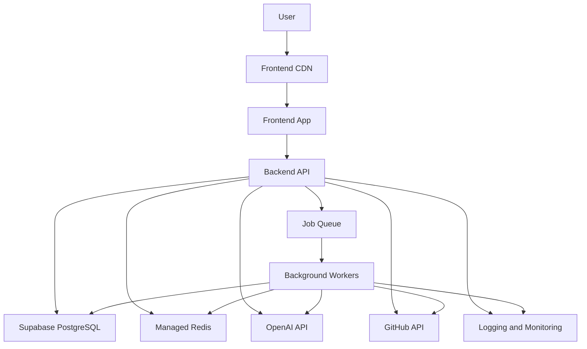
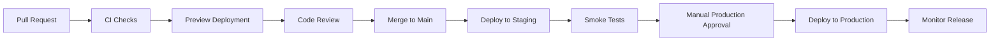

# RepoMind AI Deployment Strategy

## Purpose

This document defines the deployment strategy for RepoMind AI. It is documentation only and does not introduce Dockerfiles, Compose files, GitHub Actions workflows, infrastructure code, scripts, or application implementation.

The deployment strategy should support fast local development, safe staging validation, reliable production releases, and a clear path toward scaling as the product grows.

## Deployment Principles

- Keep development, staging, and production environments separate.
- Use environment-driven configuration.
- Never commit secrets or production credentials.
- Build repeatable deployments through CI/CD.
- Keep backend API and background workers independently deployable.
- Run database migrations through controlled release steps.
- Monitor production health, cost, and usage from the first customer-facing deployment.
- Prefer managed infrastructure early, while preserving a migration path to more controlled infrastructure.
- Document rollback procedures before production launch.

## Target Runtime Architecture

Recommended early production split:

- Frontend: Vercel.
- Backend API: Railway or Render.
- Background workers: Railway or Render.
- Database: Supabase PostgreSQL with `pgvector`.
- Redis: Managed Redis from Railway, Render, Upstash, or equivalent.
- AI provider: OpenAI or compatible provider through backend-only credentials.
- Repository provider: GitHub OAuth or GitHub App.

## Local Development

Local development should optimize for fast feedback and consistency with production.

Recommended local services:

- Frontend development server.
- Backend FastAPI development server.
- PostgreSQL. `pgvector` is recommended locally but optional for v0.2.0 migrations.
- Redis.
- Background worker process.
- Optional local object storage emulator if file artifacts are introduced.

Local development requirements:

- Use `.env.local` or equivalent local-only environment files.
- Provide `.env.example` without real secrets.
- Use Docker Compose for database, Redis, and supporting services.
- Allow frontend and backend to run independently for faster iteration.
- Seed development data through explicit scripts once application code exists.
- Keep local AI and GitHub credentials separate from staging and production.

Recommended local workflow:

1. Start PostgreSQL and Redis through Docker Compose.
2. Run database migrations.
3. Start backend API.
4. Start background worker.
5. Start frontend development server.
6. Connect to local services through environment variables.

Local safety rules:

- Do not use production database credentials locally.
- Do not ingest sensitive customer repositories in local development unless explicitly authorized.
- Do not log full private repository content during local debugging unless using personal test repositories.

## Docker

Docker should provide repeatable runtime packaging for the backend API and workers.

Recommended container images:

- `repomind-backend`: FastAPI API service.
- `repomind-worker`: Background worker service using the same application image with a different command.
- Optional future `repomind-migrations`: Controlled migration runner.

Docker requirements:

- Use slim base images where practical.
- Install only runtime dependencies in production images.
- Run as a non-root user.
- Keep secrets out of images.
- Use environment variables for runtime configuration.
- Add health check endpoints for API services.
- Keep image builds deterministic through lockfiles.
- Scan images for vulnerabilities in CI.

Image tagging strategy:

- Tag by Git SHA for immutable releases.
- Tag staging images with branch or pull request identifiers.
- Tag production releases with semantic version or release number.

## Docker Compose

Docker Compose should be used for local infrastructure, not as the primary long-term production orchestration strategy.

Recommended Compose services:

- `postgres`
- `redis`
- `backend`
- `worker`
- `frontend`, optional if the team wants fully containerized local development

Compose requirements:

- Persist PostgreSQL data in a named local volume.
- Expose only necessary ports.
- Configure health checks for PostgreSQL and Redis.
- Keep local credentials non-production.
- Use `.env.local` or `.env.compose` for local-only configuration.

Recommended local Compose responsibilities:

- Start database and queue dependencies.
- Provide consistent PostgreSQL extensions such as `pgvector` when available.
- Support running migrations against local PostgreSQL.
- For v0.2.0 local development, Alembic can run without `pgvector`; the indexing migration uses a nullable JSONB placeholder for `embeddings.embedding` when `APP_ENV` is local/test and the `vector` extension is not already installed.
- TODO: `pgvector` is required before v0.3.0 Repository Intelligence, when indexing, embeddings, and vector retrieval become active.
- Support worker testing for indexing and AI jobs.

## Vercel Deployment

Vercel is recommended for the frontend when using React, Vite, or Next.js.

Vercel responsibilities:

- Host static frontend assets or Next.js application.
- Provide preview deployments for pull requests.
- Manage frontend environment variables.
- Serve assets through global CDN.

Frontend environment variables:

- Public API base URL.
- Public application environment name.
- Public analytics or monitoring keys, if any.

Vercel rules:

- Only expose variables intended for the browser.
- Never store backend secrets as public frontend variables.
- Use separate Vercel projects or environments for preview, staging, and production.
- Configure production domain and HTTPS.
- Configure redirects and rewrites intentionally.

Recommended Vercel environments:

- Preview: Automatically created from pull requests.
- Staging: Tracks a staging branch or manual promotion.
- Production: Tracks release branch or manually promoted deployment.

## Railway or Render Deployment

Railway and Render are suitable early-stage platforms for deploying the backend API and background workers without heavy infrastructure management.

Recommended services:

- Backend API web service.
- Background worker service.
- Optional scheduled worker for cleanup or maintenance jobs.
- Managed Redis if not using an external provider.

Backend deployment requirements:

- Deploy from immutable container image or locked build command.
- Configure health check path.
- Set environment variables in the platform secret manager.
- Run with production process manager settings.
- Disable debug mode.
- Configure autoscaling or manual scaling based on platform support.

Worker deployment requirements:

- Run worker command separately from API command.
- Configure concurrency according to CPU, memory, provider rate limits, and database capacity.
- Use retry policies and dead-letter handling where supported by the job system.
- Monitor queue length and job failures.

Platform selection guidance:

- Railway is often faster for early iteration and simple service composition.
- Render provides straightforward web services, workers, cron jobs, and managed databases.
- Either platform should remain replaceable because core application code should not depend on platform-specific APIs.

## Supabase Configuration

Supabase can provide managed PostgreSQL with `pgvector` support for early production.

Supabase responsibilities:

- PostgreSQL database.
- `pgvector` extension.
- Backups and point-in-time recovery, depending on plan.
- Connection pooling.
- Database dashboard and monitoring.

Recommended Supabase setup:

- Create separate projects for staging and production.
- Enable `pgvector` in staging and production before applying repository intelligence migrations.
- Configure connection pooling for API and worker services.
- Use least-privilege database roles.
- Store database connection strings in backend and worker secret environments only.
- Restrict direct database access to approved developers and services.

Supabase security considerations:

- Do not expose service-role credentials to the frontend.
- Do not rely on Supabase client-side access for core repository intelligence data in the initial architecture.
- Keep application-level authorization in the backend.
- Use database backups and restore testing before production launch.

Future considerations:

- Move to dedicated managed PostgreSQL if workload, compliance, or operational needs outgrow Supabase.
- Add read replicas if supported and justified.
- Evaluate dedicated vector storage if `pgvector` latency or index size becomes a bottleneck.

## Environment Variables

Configuration must be environment-driven and validated at startup.

Recommended environment categories:

### Application

- `APP_ENV`
- `APP_BASE_URL`
- `API_BASE_URL`
- `FRONTEND_BASE_URL`
- `LOG_LEVEL`
- `CORS_ALLOWED_ORIGINS`

### Database

- `DATABASE_URL`
- `DATABASE_POOL_SIZE`
- `DATABASE_MAX_OVERFLOW`
- `DATABASE_SSL_MODE`

### Redis and Queue

- `REDIS_URL`
- `QUEUE_NAME`
- `WORKER_CONCURRENCY`
- `JOB_RETRY_MAX_ATTEMPTS`

### Authentication and Sessions

- `SESSION_SECRET`
- `SESSION_COOKIE_NAME`
- `SESSION_COOKIE_SECURE`
- `SESSION_TTL_SECONDS`
- `CSRF_SECRET`

### GitHub

- `GITHUB_CLIENT_ID`
- `GITHUB_CLIENT_SECRET`
- `GITHUB_REDIRECT_URI`
- `GITHUB_WEBHOOK_SECRET`

### AI Provider

- `OPENAI_API_KEY`
- `OPENAI_MODEL`
- `OPENAI_EMBEDDING_MODEL`
- `AI_REQUEST_TIMEOUT_SECONDS`
- `AI_MAX_TOKENS`

### Rate Limits

- `RATE_LIMIT_LOGIN_PER_MINUTE`
- `RATE_LIMIT_CHAT_PER_MINUTE`
- `RATE_LIMIT_SEARCH_PER_MINUTE`
- `RATE_LIMIT_INDEXING_PER_HOUR`

### Observability

- `OTEL_EXPORTER_OTLP_ENDPOINT`
- `SENTRY_DSN`
- `METRICS_ENABLED`
- `TRACE_SAMPLE_RATE`

Environment variable rules:

- Keep `.env.example` updated when application configuration changes.
- Never commit `.env`, `.env.local`, or production values.
- Validate required variables at service startup.
- Use different values for development, staging, and production.
- Rotate secrets after suspected exposure.

## CI/CD Using GitHub Actions

GitHub Actions should enforce quality before merge and automate deployments after approval.

Recommended CI checks:

- Frontend install and lockfile validation.
- Frontend lint.
- Frontend type check.
- Frontend unit tests.
- Backend install and lockfile validation.
- Backend lint.
- Backend type checks where practical.
- Backend unit tests.
- Integration tests where supported.
- Security and dependency scans.
- Docker image build validation.
- Migration check once database code exists.

Recommended CD flow:

Branch expectations:

- Pull requests run CI and preview deployments.
- `main` deploys to staging automatically.
- Production deploys require manual approval or release tagging.
- Hotfix branches follow the same validation path with expedited review.

Deployment gates:

- CI must pass.
- Migrations must be reviewed.
- Security-sensitive changes require additional review.
- Production deployment requires clear rollback path.

## Production Monitoring

Production monitoring should cover user experience, API health, worker health, database health, provider dependencies, and AI costs.

Core metrics:

- API request latency.
- API error rate.
- HTTP status code distribution.
- Background job queue depth.
- Background job duration.
- Background job failure and retry rate.
- Repository indexing duration.
- AI provider latency and error rate.
- Token usage and cost.
- Database CPU, memory, storage, connections, and slow queries.
- Redis memory and command latency.
- Frontend page load and client error rates.

Recommended tools:

- Sentry for application errors.
- OpenTelemetry-compatible tracing.
- Platform metrics from Vercel, Railway, Render, and Supabase.
- Uptime monitoring for frontend and backend.
- Log aggregation through the deployment platform or a dedicated provider.

Alerting priorities:

- Backend API unavailable.
- Error rate spike.
- Database connection exhaustion.
- Queue backlog above threshold.
- Indexing failure spike.
- AI provider outage.
- Token usage above expected budget.
- Backup failure.

## Logging

Logging must be structured, searchable, and safe.

Logging requirements:

- Use JSON logs in production.
- Include request ID.
- Include user ID and repository ID where safe.
- Include job ID for worker logs.
- Include provider name for external dependency errors.
- Redact secrets, tokens, API keys, cookies, authorization headers, and private source content.
- Avoid logging full prompts, full source files, and full AI responses in production.

Log levels:

- `debug`: Local diagnostics only.
- `info`: Normal lifecycle events.
- `warning`: Recoverable unexpected conditions.
- `error`: Failed operations needing attention.
- `critical`: System-wide failure or data integrity risk.

Retention recommendations:

- Development: short retention.
- Staging: moderate retention for debugging.
- Production: retention based on security, compliance, and cost requirements.
- Audit logs should have a separate retention policy from application logs.

## Backups

Backup strategy should prioritize the database, audit logs, and recoverability of repository intelligence.

Database backup requirements:

- Automated full backups.
- Point-in-time recovery for production.
- Backup encryption at rest.
- Separate backup retention for staging and production.
- Restore testing on a regular schedule.
- Alerts for failed backups.

Data recovery considerations:

- Repository metadata and user data are critical.
- Audit logs are critical for security and compliance.
- Code chunks and embeddings may be regenerable, but regeneration cost must be considered.
- Chat history and citations may be customer-critical and should be backed up.

Backup frequency:

- Development: optional local backup.
- Staging: daily or provider-managed backups.
- Production: daily backups plus point-in-time recovery.

Restore process:

1. Identify incident scope and target restore time.
2. Freeze writes if needed.
3. Restore database to a new instance.
4. Validate schema, migrations, and critical data.
5. Redirect application to restored database if approved.
6. Verify application health.
7. Document incident and follow-up actions.

## Scaling Strategy

Scaling should be incremental and driven by measured bottlenecks.

### Frontend Scaling

- Use Vercel CDN and static asset caching.
- Optimize bundle size.
- Monitor frontend performance.
- Use preview deployments to catch regressions.

### Backend API Scaling

- Scale horizontally across multiple API instances.
- Keep API processes stateless.
- Use database connection pooling.
- Cache low-risk metadata where useful.
- Apply rate limits to expensive endpoints.

### Worker Scaling

- Scale workers separately from API.
- Use queue depth and job latency as scaling signals.
- Separate queues for indexing, embeddings, summaries, and maintenance if needed.
- Limit concurrency based on GitHub, OpenAI, database, and memory constraints.

### Database Scaling

- Add indexes based on real query plans.
- Use connection pooling.
- Tune slow queries.
- Add read replicas for heavy read workloads.
- Partition high-volume tables when necessary.
- Consider dedicated vector database if pgvector becomes a bottleneck.

### AI Cost Scaling

- Cache reusable repository summaries.
- Avoid regenerating embeddings for unchanged chunks.
- Use model routing by task complexity.
- Track token usage per user, repository, and organization.
- Introduce plan-based quotas.

## Cost Estimation

Costs will vary by usage, repository size, indexing frequency, AI model choice, and traffic.

Early MVP monthly cost categories:

| Category | Low Usage Estimate | Notes |
| --- | ---: | --- |
| Frontend hosting | $0-$25 | Vercel free or starter tier. |
| Backend hosting | $10-$50 | Railway or Render small service. |
| Worker hosting | $10-$75 | Depends on indexing volume. |
| PostgreSQL | $25-$100 | Supabase or managed Postgres. |
| Redis | $0-$30 | Small managed Redis or platform add-on. |
| AI API usage | $20-$300+ | Highly variable by repository size and chat volume. |
| Monitoring | $0-$50 | Free tiers initially. |
| Domain and email | $10-$30 | Domain, transactional email if needed. |

Growth-stage cost drivers:

- Number of indexed repositories.
- Repository size and file count.
- Embedding generation volume.
- Chat usage and selected AI models.
- Architecture summary regeneration frequency.
- Database storage and vector index size.
- Worker concurrency.
- Log and trace retention.

Cost controls:

- Set AI provider budget alerts.
- Track token usage by customer and feature.
- Set indexing limits per plan.
- Avoid re-indexing unchanged files.
- Tune chunk size and retrieval limits.
- Apply log sampling for high-volume traces.

## Rollback Strategy

Rollback must be possible for frontend, backend, workers, and database changes.

Frontend rollback:

- Promote previous Vercel deployment.
- Verify API compatibility.
- Monitor frontend errors after rollback.

Backend rollback:

- Redeploy previous container image or platform release.
- Ensure previous version is compatible with current database schema.
- Monitor API health and error rates.

Worker rollback:

- Stop new worker deployment.
- Redeploy previous worker image.
- Ensure queued job payloads are backward compatible.
- Requeue or fail jobs safely when payload versions are incompatible.

Database rollback:

- Prefer forward-compatible migrations over destructive changes.
- Use expand-and-contract migration pattern.
- Avoid relying on downgrade migrations for large production incidents.
- Restore from backup only for severe data corruption or irreversible failure.

Rollback readiness checklist:

- Previous frontend deployment is available.
- Previous backend image is available.
- Previous worker image is available.
- Migration impact is documented.
- Feature flags can disable risky functionality.
- Monitoring confirms rollback success.

## Release Workflow

Recommended release workflow:

1. Create a small, focused pull request.
2. Run CI checks.
3. Review code, documentation, migrations, and security impact.
4. Deploy preview environment.
5. Merge to `main`.
6. Automatically deploy to staging.
7. Run smoke tests and critical workflow checks.
8. Review release notes and migration plan.
9. Approve production deployment.
10. Deploy frontend, backend, workers, and migrations in the correct order.
11. Monitor production metrics and logs.
12. Record follow-up tasks and incidents if needed.

Release types:

- Standard release: planned feature or fix.
- Hotfix release: urgent production fix with expedited review.
- Infrastructure release: deployment, platform, or operational change.
- Migration release: schema or data migration requiring special care.

Production deployment order:

1. Apply backward-compatible database migrations.
2. Deploy backend API.
3. Deploy workers.
4. Deploy frontend.
5. Enable feature flags if needed.
6. Run smoke tests.
7. Monitor release.

Smoke test examples:

- User can log in.
- User can list repositories.
- User can view repository details.
- Index status endpoint responds.
- Chat endpoint handles a safe test request in staging.
- Worker can process a small indexing job in staging.

Release notes should include:

- Summary of changes.
- User-facing impact.
- Migration notes.
- Rollback notes.
- Known risks.
- Monitoring focus areas.

## Production Readiness Checklist

Before production launch:

- Staging environment exists and mirrors production configuration closely.
- Production secrets are stored in managed secret systems.
- CI checks are required before merge.
- Production deploy requires approval.
- Database backups and point-in-time recovery are enabled.
- Restore process has been tested.
- Monitoring and alerting are configured.
- Structured logging is enabled.
- Rate limits are configured.
- CORS and security headers are configured.
- Rollback process is documented and tested.
- GitHub OAuth production app is configured with exact redirect URIs.
- OpenAI API key is backend-only and budget alerts are configured.
- Worker queue monitoring is in place.
- Documentation is updated for deployment and operations.

