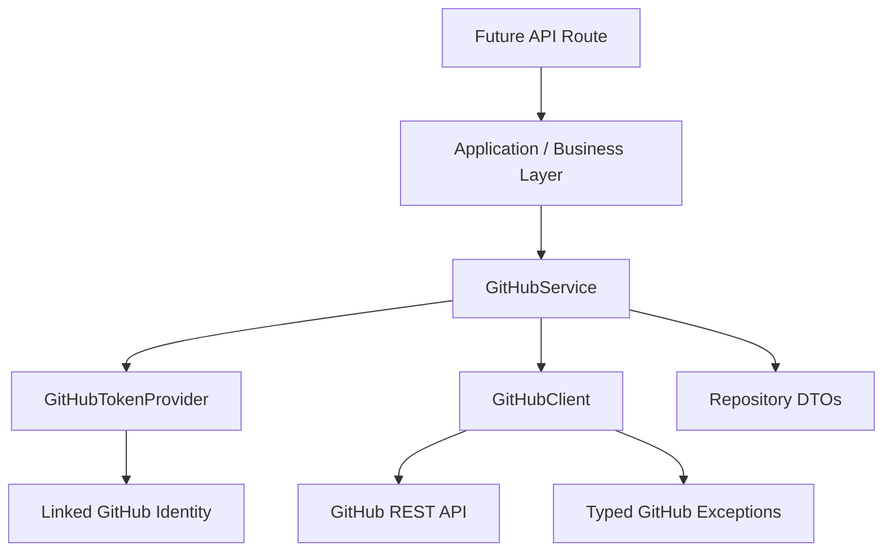
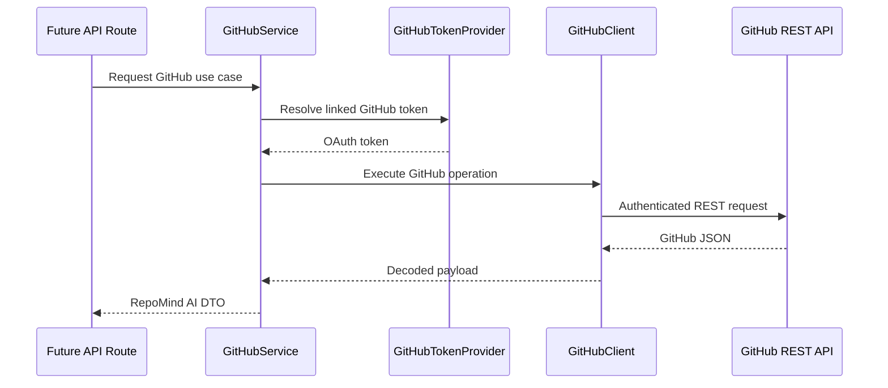

# GitHub Architecture

RepoMind AI treats GitHub as an external integration behind explicit domain,
application, and infrastructure boundaries. Sprint 3.9A creates the foundation
only: no repository listing UI, repository registration, cloning, indexing, or
AI behavior is enabled.

## Dependency Flow

## GitHub Client

`GitHubClient` is the only component allowed to perform raw GitHub HTTP
requests. It owns:

- authenticated request headers;
- timeout handling;
- retry behavior for transient failures;
- GitHub rate-limit detection;
- pagination helpers based on `Link` headers;
- typed error mapping;
- structured logging without tokens or secrets.

Application services must not import `httpx` or construct GitHub request
headers directly.

## GitHub Service

`GitHubService` is the application-facing boundary for future GitHub use cases.
It depends on `GitHubClient` and `GitHubTokenProvider`, so future routes and
business workflows do not know how tokens are retrieved or how HTTP requests are
made.

The service currently supports foundation behavior only:

- verify that a linked account token can call GitHub;
- map GitHub repository payloads into RepoMind AI repository DTOs.

## Token Provider

`GitHubTokenProvider` hides linked identity token retrieval from services.
Sprint 3.9A includes `SupabaseLinkedIdentityGitHubTokenProvider` as the adapter
boundary for linked Supabase GitHub identities.

Production token storage must be designed before repository features are built.
Provider tokens must never be logged, returned to the frontend, or stored
unencrypted.

## DTO Mapping

GitHub JSON is normalized into RepoMind AI DTOs:

- `RepositorySummary`
- `RepositoryOwner`
- `RepositoryPermissions`
- `RepositoryLicense`
- `RepositoryLanguage`

Future API responses should expose RepoMind AI DTOs, not raw GitHub JSON.

## Error Model

GitHub failures are centralized as typed exceptions:

- `GitHubUnauthorized`
- `GitHubRateLimited`
- `GitHubNotFound`
- `GitHubUnavailable`

Future API routes should translate these through the existing standard response
envelope.

## Future Repository Features

Future repository features should follow this path:

Repository listing, registration, cloning, indexing, and AI workflows must be
implemented in later sprints using this foundation.