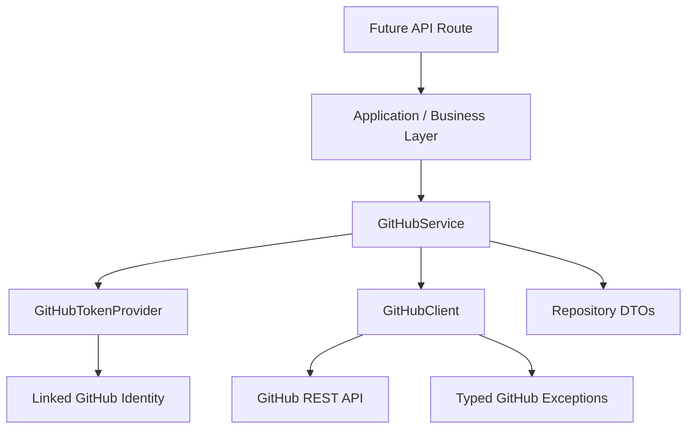
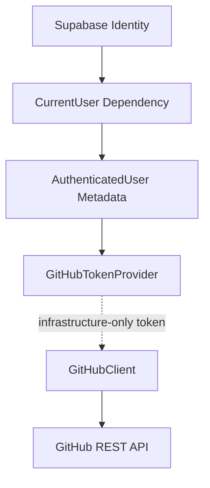
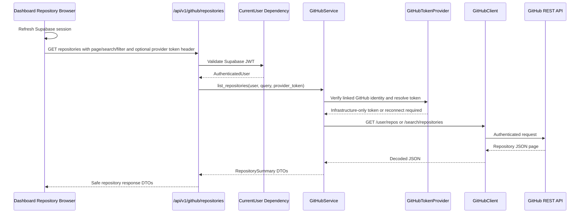
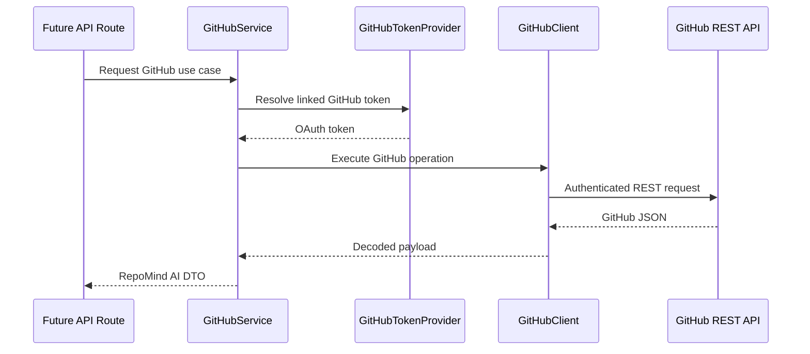

# GitHub Architecture

RepoMind AI treats GitHub as an external integration behind explicit domain,
application, and infrastructure boundaries. Sprint 3.9A creates the foundation
only: no repository listing UI, repository registration, cloning, indexing, or
AI behavior is enabled.

## Dependency Flow

## GitHub Client

`GitHubClient` is the only component allowed to perform raw GitHub HTTP
requests. It owns:

- authenticated request headers;
- timeout handling;
- retry behavior for transient failures;
- GitHub rate-limit detection;
- pagination helpers based on `Link` headers;
- typed error mapping;
- structured logging without tokens or secrets.

Application services must not import `httpx` or construct GitHub request
headers directly.

## GitHub Service

`GitHubService` is the application-facing boundary for future GitHub use cases.
It depends on `GitHubClient` and `GitHubTokenProvider`, so future routes and
business workflows do not know how tokens are retrieved or how HTTP requests are
made.

The service currently supports foundation behavior only:

- verify that a linked account token can call GitHub;
- map GitHub repository payloads into RepoMind AI repository DTOs.

## Token Provider

`GitHubTokenProvider` hides linked identity token retrieval from services.
Sprint 3.9A includes `SupabaseLinkedIdentityGitHubTokenProvider` as the adapter
boundary for linked Supabase GitHub identities.

Production token storage must be designed before repository features are built.
Provider tokens must never be logged, returned to the frontend, or stored
unencrypted.

## Provider Token Boundary

RepoMind AI keeps GitHub provider token handling behind the infrastructure
boundary. Production routes must never return provider tokens, refresh tokens, or
safe-looking debug wrappers that reveal token availability. Backend services may
ask the `GitHubTokenProvider` for an infrastructure-only access token when a real
GitHub use case requires it.

The frontend can show whether a GitHub identity is linked by reading Supabase
user identities from the active session. It does not receive backend token
availability diagnostics.

## Token Verification Limitations

The backend authenticates requests with the Supabase JWT. Supabase sessions can
expose provider tokens to trusted client/server callback code, but provider
access tokens are not normally embedded in the JWT sent to the backend.

For repository discovery, the frontend refreshes the active Supabase session
before the GitHub repository request. If Supabase returns a GitHub
`provider_token`, the frontend sends it to the backend in the private
`X-GitHub-Provider-Token` request header. The backend accepts that token only
after the authenticated Supabase JWT proves that the current user has a linked
GitHub identity. The token is used immediately by `GitHubClient` and is never
returned in API responses, stored in the database, or logged.

If the user has a linked GitHub identity but Supabase does not provide a usable
provider token, the backend returns `github_reconnect_required`. The frontend
shows reconnect guidance and starts the existing Supabase identity-linking flow.

Before deeper repository operations are enabled, RepoMind AI should finalize a
secure provider token strategy. Acceptable options include encrypted server-side
token storage, a short-lived backend token handoff during OAuth callback, or an
official Supabase-supported server flow. Tokens must remain infrastructure-only
and must not be serialized through application DTOs or frontend responses.

## DTO Mapping

GitHub JSON is normalized into RepoMind AI DTOs:

- `RepositorySummary`
- `RepositoryOwner`
- `RepositoryPermissions`
- `RepositoryLicense`
- `RepositoryLanguage`

Future API responses should expose RepoMind AI DTOs, not raw GitHub JSON.

## Error Model

GitHub failures are centralized as typed exceptions:

- `GitHubUnauthorized`
- `GitHubRateLimited`
- `GitHubNotFound`
- `GitHubUnavailable`

Future API routes should translate these through the existing standard response
envelope.

## Repository Discovery Flow

Sprint 3.9C adds read-only repository discovery through:

`GET /api/v1/github/repositories`

The endpoint is protected by the existing Supabase JWT authentication pipeline.
It requires a linked GitHub identity with an available provider token, then uses
`GitHubService`, `GitHubTokenProvider`, and `GitHubClient` to fetch one page of
repositories from GitHub.

Repository discovery is intentionally read-only. It does not register
repositories, clone repositories, create embeddings, index source code, or start
AI workflows.

## GitHub Pagination and Filters

Repository discovery supports these query parameters:

- `page`: one-based GitHub page number.
- `per_page`: page size, capped by the backend at 100.
- `sort`: `created`, `updated`, `pushed`, or `full_name`.
- `direction`: `asc` or `desc`.
- `visibility`: `all`, `public`, or `private`.
- `search`: repository name search executed through GitHub Search API.

The backend forwards pagination, sort, direction, and visibility to GitHub.
When `search` is provided, the backend uses GitHub Search API with `in:name`,
`fork:true`, and the requested visibility qualifier. Search therefore runs
across accessible GitHub repositories while preserving the existing pagination
contract.

## Repository Discovery DTO Mapping

The API returns only RepoMind AI repository summary DTOs:

- `id`
- `name`
- `full_name`
- `owner`
- `private`
- `visibility`
- `language`
- `default_branch`
- `updated_at`
- `description`
- `html_url`
- `permissions`

Raw GitHub JSON, provider tokens, refresh tokens, and unrelated GitHub fields
must not be returned to the frontend.

## Future Repository Features

Future repository features should follow this path:

Repository listing, registration, cloning, indexing, and AI workflows must be
implemented in later sprints using this foundation.

