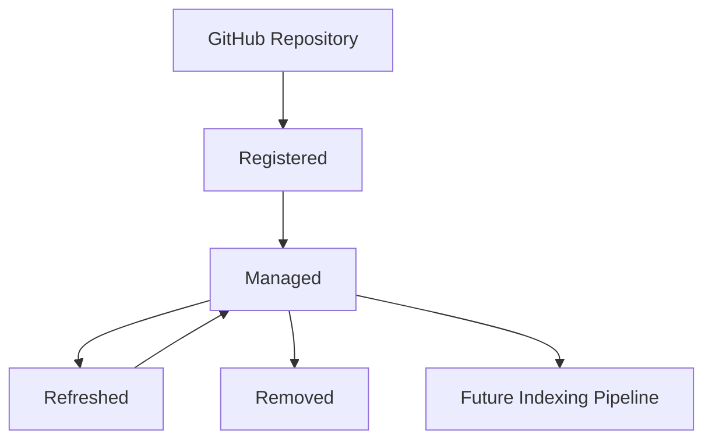
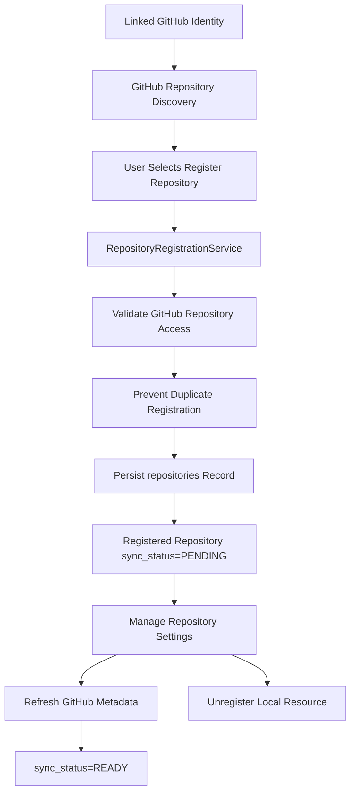
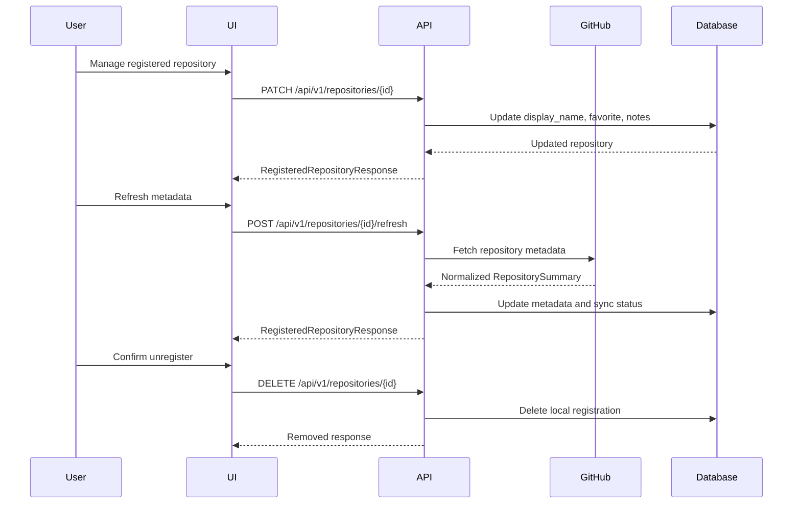
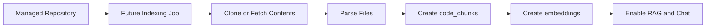

# Repository Architecture

RepoMind AI treats GitHub repositories and registered repositories as separate concepts. GitHub discovery is a read-only view of repositories accessible through a linked GitHub identity. Repository registration converts one of those discovered repositories into a managed RepoMind AI resource. Repository management lets the user maintain local settings and refresh GitHub metadata without cloning, indexing, embedding, parsing, or running AI workflows.

## Current Scope

Implemented through Sprint 3.12:

- Browse accessible GitHub repositories through the existing GitHub client and service layer.
- Register a GitHub repository for the authenticated local user.
- Prevent duplicate registration for the same user.
- Store repository metadata with an initial `PENDING` sync status.
- Display registered repositories in `/repositories`.
- Open a dashboard for each registered repository at `/repositories/[repositoryId]`.
- Update local repository settings: `display_name`, `favorite`, and `notes`.
- Refresh GitHub metadata: description, language, default branch, visibility, and GitHub updated timestamp.
- Unregister a repository from RepoMind AI without deleting it from GitHub.

Explicitly not implemented yet:

- Repository cloning.
- Repository content parsing.
- Repository indexing.
- Embedding generation.
- RAG or AI chat.

## Repository Lifecycle

Lifecycle states:

- `Registered`: a GitHub repository has been validated and stored as a local `repositories` record.
- `Managed`: the user can favorite it, set an alias, add notes, open its dashboard, refresh metadata, or unregister it.
- `Refreshed`: GitHub metadata has been refreshed through the GitHub API without repository content access.
- `Removed`: the local RepoMind AI registration is deleted; the GitHub repository remains untouched.

Supported `sync_status` values:

- `PENDING`: registered but not refreshed or processed yet.
- `READY`: metadata refresh completed successfully.
- `ERROR`: the latest metadata refresh failed or requires attention.

## Conceptual Flow

## Backend Layers

### API Layer

Repository endpoints are protected by the existing authentication and user synchronization pipeline:

- `GET /api/v1/repositories`: list repositories registered by the authenticated user.
- `POST /api/v1/repositories/register`: register a discovered GitHub repository.
- `GET /api/v1/repositories/{id}`: return one owner-scoped registered repository.
- `PATCH /api/v1/repositories/{id}`: update local settings only.
- `POST /api/v1/repositories/{id}/refresh`: refresh GitHub metadata only.
- `DELETE /api/v1/repositories/{id}`: unregister the local managed repository.

The API never allows mutation of GitHub identity fields such as provider, provider repository id, full name, or owner login through settings updates.

### Application Layer

`RepositoryRegistrationService` owns the repository lifecycle use cases:

- Validate that the GitHub repository can be resolved through `GitHubService`.
- Validate GitHub repository id, full name, and default branch during registration.
- Check existing registrations through `RepositoryRepository`.
- Persist a local `repositories` row with `sync_status = PENDING`.
- Update local settings without touching GitHub identity metadata.
- Refresh metadata from normalized `RepositorySummary` DTOs.
- Delete the local registration without calling any GitHub delete APIs.

### Repository Layer

`RepositoryRepository` encapsulates repository table operations:

- Lookup by owner and GitHub repository id.
- Lookup by owner and local repository id.
- List registered repositories by owner.
- Stage registered repository creation.
- Update local management settings.
- Update refreshed GitHub metadata.
- Delete local repository registrations.

Future services should continue to use this repository layer rather than exposing ORM queries directly.

### GitHub Layer

`GitHubService` uses `GitHubClient` and `GitHubTokenProvider` to validate and refresh repository metadata without exposing OAuth provider tokens outside infrastructure. Repository management relies on normalized `RepositorySummary` DTOs, not raw GitHub JSON.

## Database Mapping

Registered repositories are stored in the existing `repositories` table.

Registration and management fields:

- `owner_user_id`: local user who registered the repository.
- `provider`: `github`.
- `provider_repository_id`: GitHub repository id.
- `owner_name`: GitHub owner login.
- `name`: repository name.
- `full_name`: GitHub `owner/name` value.
- `default_branch`: GitHub default branch from registration or latest metadata refresh.
- `visibility`: public/private/internal metadata.
- `display_name`: optional local alias.
- `favorite`: local favorite flag.
- `notes`: optional local notes.
- `language`: primary GitHub language when available.
- `description`: GitHub repository description when available.
- `web_url`: GitHub HTML URL.
- `registered_at`: timestamp when the repository became managed by RepoMind AI.
- `sync_status`: `PENDING`, `READY`, or `ERROR`.
- `last_synced_at`: timestamp of the latest successful metadata refresh.
- `github_updated_at`: latest GitHub repository update timestamp returned by GitHub metadata.

## Frontend Flow

`/repositories` shows only registered repositories and management actions. `/repositories/[repositoryId]` remains the dashboard home for a managed repository.

## Future Indexing Pipeline

Registration and management prepare the repository for future processing. The future pipeline should be triggered separately from registration and should use background jobs.

This separation keeps user intent explicit: managing a repository means RepoMind AI tracks metadata and local settings, but repository contents are not fetched or analyzed during Sprint 3.12.