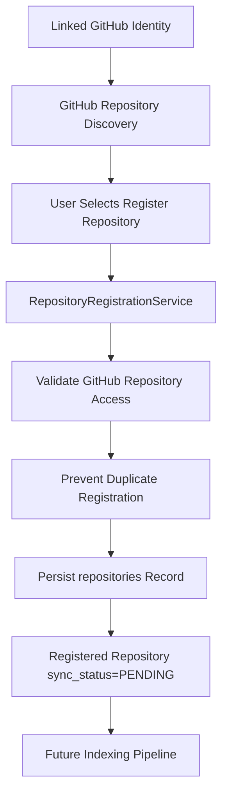
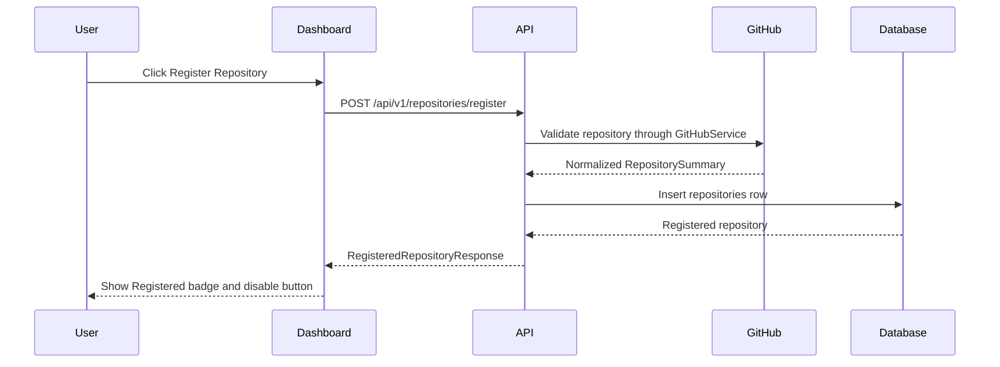

# Repository Architecture

RepoMind AI treats GitHub repositories and registered repositories as separate concepts. GitHub discovery is a read-only view of repositories accessible through a linked GitHub identity. Repository registration converts one of those discovered repositories into a managed RepoMind AI resource that can later enter indexing, analysis, and AI workflows.

## Current Scope

Sprint 3.10 implements repository registration only.

Implemented now:

- Browse accessible GitHub repositories through the existing GitHub client and service layer.
- Register a GitHub repository for the authenticated local user.
- Prevent duplicate registration for the same user.
- Store repository metadata with an initial `PENDING` sync status.
- Display registered repositories in `/repositories`.

Explicitly not implemented yet:

- Repository cloning.
- Repository content parsing.
- Repository indexing.
- Embedding generation.
- RAG or AI chat.

## Conceptual Flow



## Backend Layers

### API Layer

`POST /api/v1/repositories/register` accepts a minimal registration request:

```json
{
  "github_repository_id": "123",
  "full_name": "owner/repository",
  "default_branch": "main"
}
```

The endpoint is protected by the existing authentication dependency. It synchronizes the authenticated Supabase user into the local database, then delegates registration to the application service. API routes do not perform SQLAlchemy queries directly and do not return ORM models.

`GET /api/v1/repositories` returns only repositories registered by the authenticated local user.

### Application Layer

`RepositoryRegistrationService` owns the registration use case:

- Validate that the GitHub repository can be resolved through `GitHubService`.
- Validate the GitHub repository id, full name, and default branch against GitHub data.
- Check existing registrations through `RepositoryRepository`.
- Persist a local `repositories` row with `sync_status = PENDING`.
- Roll back the transaction on persistence errors.

### Repository Layer

`RepositoryRepository` encapsulates repository table operations:

- Lookup by owner and GitHub repository id.
- List registered repositories by owner.
- Stage registered repository creation.

Future services should continue to use this repository layer rather than exposing ORM queries directly.

### GitHub Layer

`GitHubService` uses `GitHubClient` and `GitHubTokenProvider` to validate the repository through GitHub without exposing OAuth provider tokens outside infrastructure. Repository registration relies on normalized `RepositorySummary` DTOs, not raw GitHub JSON.

## Database Mapping

Registered repositories are stored in the existing `repositories` table.

Registration-related fields:

- `owner_user_id`: local user who registered the repository.
- `provider`: `github`.
- `provider_repository_id`: GitHub repository id.
- `owner_name`: GitHub owner login.
- `name`: repository name.
- `full_name`: GitHub `owner/name` value.
- `default_branch`: GitHub default branch at registration time.
- `visibility`: public/private/internal metadata.
- `language`: primary GitHub language when available.
- `description`: GitHub repository description when available.
- `web_url`: GitHub HTML URL.
- `registered_at`: timestamp when the repository became managed by RepoMind AI.
- `sync_status`: initial value `PENDING`; future indexing work will transition this status.

## Frontend Flow



The dashboard overlays registered state onto GitHub discovery cards. `/repositories` shows only registered repositories and does not display unregistered GitHub discovery results.

## Future Indexing Pipeline

Registration prepares the repository for future processing. The future pipeline should be triggered separately from registration and should use background jobs.


This separation keeps user intent explicit: registering a repository means RepoMind AI is allowed to manage it, but no repository contents are fetched or analyzed during Sprint 3.10.