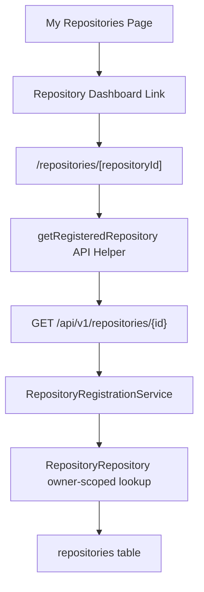
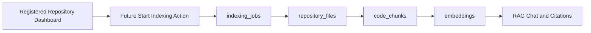

# Repository Dashboard

The repository dashboard is the home page for a registered RepoMind AI repository. It presents local repository metadata, registration state, synchronization status, and intentionally disabled future AI sections without cloning, indexing, embedding, or parsing repository contents.

## Scope

Implemented in Sprint 3.11:

- `GET /api/v1/repositories/{id}` for owner-scoped repository detail retrieval.
- `/repositories/[repositoryId]` as the managed repository dashboard page.
- Navigation from `/repositories` to each repository dashboard.
- Status cards for registration, sync state, default branch, and metadata freshness.
- Disabled placeholders for future indexing, embeddings, code understanding, and repository chat.

Not implemented in this sprint:

- Repository cloning.
- Repository indexing.
- Embedding generation.
- AI chat.
- Repository content parsing.

## Dashboard Architecture

The frontend dashboard does not call GitHub directly. It reads only the local registered repository resource from the backend. This keeps the dashboard stable even when GitHub is unavailable and keeps provider-token handling inside backend infrastructure.

## Backend Detail Endpoint

`GET /api/v1/repositories/{id}` returns the existing registered repository DTO:

- Local repository id.
- Local owner user id.
- GitHub repository id.
- Repository name and full name.
- Owner login.
- Default branch.
- Visibility.
- Language.
- Description.
- GitHub URL.
- Registered date.
- Sync status.
- Created and updated dates.

The endpoint is protected by the existing authentication and user synchronization pipeline. The repository lookup is scoped by `owner_user_id`, so repositories owned by other users return the same safe not-found response as missing repositories.

## Dashboard Sections

### Header

The header shows the repository name, full name, owner login, visibility badge, language badge, GitHub link, and registration badge.

### Repository Overview

The overview displays the repository description from registration metadata. If the repository has no description, the UI renders a neutral empty description message.

### Repository Metadata

Metadata includes owner, visibility, language, default branch, and GitHub repository id.

### Registration Information

Registration details include local repository id, registered date, and local metadata update date.

### Synchronization Status

The synchronization section shows the current `sync_status`. Sprint 3.11 initializes and displays status only; it does not run indexing or background synchronization.

### Future AI Features

Disabled placeholders communicate planned capabilities without implying they are active:

- Future Index Status: Available in v0.3.
- Future Embedding Status: Available in v0.3.
- Code Understanding: Available in v0.3.
- Repository Chat: Available in v0.3.
- AI Engineering Insights: Available in v0.3.

## Error Handling

The dashboard displays friendly states for:

- Repository not found.
- Repository owned by another user.
- Deleted or unavailable repository records.
- Temporary API failures.

All of these states avoid exposing whether another account owns a repository id.

## Future AI Integration

Future indexing should start from a registered repository and create explicit background jobs. The dashboard can later subscribe to job status and progressively enable AI sections.

Until those milestones exist, the dashboard must keep AI controls disabled and must not trigger repository content access.